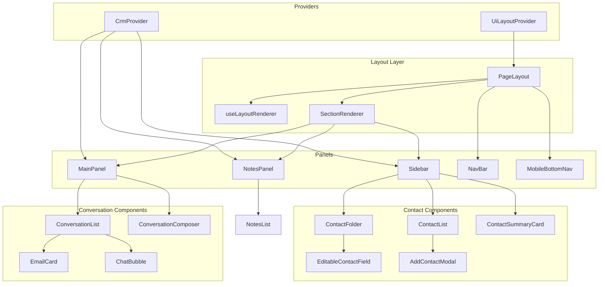

# Pulse CRM

A **config-driven CRM starter** built with React 19, TypeScript, and Vite. Contact folders, field definitions, notes, conversations, and the full page layout are rendered from JSON — no hardcoded panel structure in JSX.

---

## Table of Contents

1. [Tech Stack](#tech-stack)
2. [Getting Started](#getting-started)
3. [Demo Walkthrough](#demo-walkthrough)
4. [User Guide](#user-guide)
5. [How the App Loads & Renders](#how-the-app-loads--renders)
6. [Hooks & Context](#hooks--context)
7. [UI & Icons](#ui--icons)
8. [JSON Configuration](#json-configuration)
9. [State Management](#state-management)
10. [Layout System](#layout-system)
11. [Responsive Design](#responsive-design)
12. [Contact Fields & Editing](#contact-fields--editing)
13. [Feature Flows](#feature-flows)
14. [Component Dependencies](#component-dependencies)
15. [Project Structure](#project-structure)
16. [Key Design Principles](#key-design-principles)

---

## Tech Stack

| Layer | Technology |
|-------|------------|
| UI | React 19 (functional components) |
| Language | TypeScript |
| Build | Vite 8 |
| Styling | Tailwind CSS v4 |
| Icons | Lucide React (`lucide-react`) |
| Animation | Framer Motion (drawers, mobile transitions) |
| CRM state | `CrmContext` + `useCrm()` |
| Layout state | `UiLayoutContext` + `useUiLayout()` |
| Layout engine | `useLayoutRenderer()` + `layout.json` |
| Data | JSON configs + mock `crmApi` |

---

## Getting Started

```bash
npm install
npm run dev
```

Open the URL shown in the terminal (usually `http://localhost:5173`).

| Command | Description |
|---------|-------------|
| `npm run dev` | Start development server |
| `npm run build` | Type-check and production build |
| `npm run preview` | Preview production build |
| `npm run lint` | Run ESLint |

---

## Demo Walkthrough

### One-line pitch

> Pulse CRM is a config-driven CRM demo. Contacts, fields, notes, conversations, and page layout come from JSON. React Context holds live state; hooks let any panel read that state without prop drilling.

### Startup flow

```
main.tsx → App → UiLayoutProvider → ContactDetailsPage
  → crmApi loads JSON → CrmProvider → PageLayout
  → useLayoutRenderer(layout.json) → Sidebar + MainPanel + NotesPanel + NavBar
```

On first load: **contact list** on the left, **no contact selected**, center shows *“No contact selected.”*

### Quick demo script

| Step | Action | Result |
|------|--------|--------|
| 1 | Open app (desktop) | List left, empty center, Notes column right, NavBar rail |
| 2 | Click a contact | Detail sidebar, conversations, notes for that contact |
| 3 | Scroll center | Email cards + chat bubbles in one timeline |
| 4 | Use composer | Send chat or email |
| 5 | Expand email | Full EmailPopup modal |
| 6 | Toggle Notes | NavBar 4th icon or panel × |
| 7 | Add note | + Add → Save note |
| 8 | Back arrow | Return to contact list |
| 9 | Resize browser | Layout switches desktop / tablet / mobile |

### NavBar icons (desktop & tablet)

| Icon (Lucide) | Label | Active? |
|---------------|-------|---------|
| `History` | History | Placeholder |
| `Network` | Network | Placeholder |
| `FileCheck` | Tasks | Placeholder |
| `FileText` | **Notes** | **Yes** — toggles Notes |
| `Calendar` | Calendar | Placeholder |

---

## User Guide

### First load

- Contact list shown; `selectedContactId` is `null`
- Center panel empty until a contact is picked
- Notes column open on desktop (empty until selection)
- NavBar always visible on desktop/tablet

### Open a contact

Click a list row → detail view, conversations, and notes load for that contact. Use **← Contact Details** to go back or **prev/next** to switch contacts.

### Add a contact

**+ Add** in the list header → modal (fields from `contactFields.json`) → **Save Contact** → new contact selected in detail view.

### Edit contact fields

| Folder | Header icons |
|--------|--------------|
| **Contact** | **+** (opens add modal) and **pencil** (edit mode) |
| **Additional Info** | **pencil** only |
| **Used Car Buyer Preferences** | **pencil** only |

Edit flow: pencil → click each field → check icon (or Enter) to stage → folder **Save** to commit. Tags edit immediately on the summary card.

### Notes

- **Desktop:** inline column; toggle via NavBar or ×
- **Tablet:** right slide-over drawer
- **Mobile:** bottom sheet via Notes tab

### Send chat or email

Select contact → composer type dropdown → type → **Send** or Enter.

### Email popup

Click **expand** (`Maximize2`) on an email card header.

---

## How the App Loads & Renders

### Layer 1 — Bootstrap

```
main.tsx
  └── App.tsx
        └── UiLayoutProvider          ← layoutMode, notesOpen, mobileSection
              └── ContactDetailsPage
                    ├── useEffect → crmApi.getContactFields()
                    ├── useEffect → crmApi.getContactData()
                    └── CrmProvider   ← contacts, maps, selection
                          └── PageLayout(config={layout.json})
```

### Layer 2 — Layout engine

```
PageLayout
  ├── useLayoutRenderer(layout.json)   ← picks desktop / tablet / mobile sections
  ├── useUiLayout()                    ← notesOpen, mobileSection
  │
  ├── DesktopShell (desktop + tablet)
  │     ├── NavBar (if navPosition: right/left)
  │     ├── SectionRenderer × inline sections
  │     └── ResponsiveDrawer (notes on tablet)
  │
  └── MobileShell (mobile)
        ├── SectionRenderer (one page section at a time)
        ├── MobileBottomNav
        └── ResponsiveDrawer (notes bottom sheet)
```

### Layer 3 — Section registry

`SectionRenderer` maps `section.component` strings from `layout.json` to React components:

| Config value | Component |
|--------------|-----------|
| `"Sidebar"` | `Sidebar` |
| `"MainPanel"` | `MainPanel` |
| `"NotesPanel"` | `NotesPanel` |

Registry lives in `src/layouts/sectionRegistry.ts`.

### Layer 4 — Panel contents

**Sidebar** (uses `useCrm`):

```
viewMode === 'list'  →  ContactList
viewMode === 'detail' + contact selected  →
  ContactDetailsHeader
  ContactSummaryCard
  ToggleButtonGroup
  SearchBar
  ContactFolder[] (from fieldsConfig.folders)
```

**MainPanel** (uses `useCrm`):

```
ConversationList  →  EmailCard / ChatBubble
ConversationComposer
```

**NotesPanel** (uses `useCrm` + `useUiLayout`):

```
NotesList  →  NoteCard[]
compose form (+ Add / Save note)
```

---

## Hooks & Context

All custom hooks live in **`src/hooks/`**. Import from `@/hooks` or `@/context` (re-exported).

```tsx
import { useCrm, useUiLayout, useLayoutRenderer } from '@/hooks';
```

### Hooks

| Hook | File | Purpose |
|------|------|---------|
| **`useCrm()`** | `useCrm.ts` | Read `CrmContext` — contacts, selection, notes, conversations, actions |
| **`useUiLayout()`** | `useUiLayout.ts` | Read `UiLayoutContext` — layout mode, notes panel, mobile tab |
| **`useLayoutRenderer(config)`** | `useLayoutRenderer.ts` | Turn `layout.json` into inline / drawer / page sections for current breakpoint |

Hooks are thin wrappers around `useContext`. **Logic lives in the Providers**, not in the hook files.

### How `useCrm` works

1. `CrmProvider` holds state (`useState`, `useCallback`, `useMemo`)
2. Provider passes value into `CrmContext`
3. Component calls `useCrm()` → gets shared CRM state
4. Action (e.g. `updateContact`) updates Provider state → all subscribers re-render

### How `useUiLayout` works

Same pattern, separate context:

1. `UiLayoutProvider` in `App.tsx` wraps the entire app
2. Tracks viewport breakpoint, notes open/closed, active mobile section
3. `NavBar`, `PageLayout`, `NotesPanel`, `MobileBottomNav` consume it

### Providers

| Provider | File | Wraps | Hook |
|----------|------|-------|------|
| `UiLayoutProvider` | `UiLayoutContext.tsx` | `App.tsx` | `useUiLayout()` |
| `CrmProvider` | `CrmContext.tsx` | `ContactDetailsPage` | `useCrm()` |

### Which components use which hook

| Hook | Consumers |
|------|-----------|
| `useCrm()` | `Sidebar`, `ContactList`, `ContactFolder`, `ContactSummaryCard`, `AddContactModal`, `MainPanel`, `ConversationComposer`, `ConversationList`, `ChatBubble`, `EmailCard`, `EmailPopup`, `NotesPanel`, `SearchBar`, `ToggleButtonGroup`, `ContactDetailsHeader` |
| `useUiLayout()` | `NavBar`, `NotesPanel`, `PageLayout`, `MobileBottomNav`, `ContactDetailsPage` |
| `useLayoutRenderer()` | `PageLayout` only |

---

## UI & Icons

### Styling

No MUI, shadcn, or Ant Design. UI is **Tailwind CSS v4** utility classes on plain HTML elements and custom React components.

Visual identity: white cards, `#F7F8FA` background, blue accents, yellow note cards (`#FFFBEB`), peach inbound chat bubbles (`#fff3e4`).

### Icons — Lucide React

Tree-shaken imports from `lucide-react`. Icons use Tailwind size classes and `strokeWidth`.

| Area | Lucide icons |
|------|--------------|
| NavBar | `History`, `Network`, `FileCheck`, `FileText`, `Calendar` |
| Mobile bottom nav | `User`, `MessageCircle`, `FileText`, `Settings` |
| Composer | `Mail`, `MessageCircle`, `Send`, `Sparkles`, `ChevronDown` |
| Contact UI | `Search`, `Pencil`, `Plus`, `Phone`, `ChevronDown`, `ArrowLeft`, `ChevronUp`, `Check`, `X` |
| Email UI | `Reply`, `Star`, `Maximize2`, `EllipsisVertical`, `X` |
| Notes | `Plus`, `X` |
| Main panel | `MessageCircle`, `ChevronDown` |

### Animation — Framer Motion

- `ResponsiveDrawer` — slide from right (tablet) or bottom (mobile)
- `MobileShell` — page transition when switching tabs
- Respects `prefers-reduced-motion`

---

## JSON Configuration

All static data lives in **`src/configs/`**. Components receive data through **`crmApi`** or context — never direct JSON imports (except `layout.json` imported by configs index).

| File | Purpose | Loaded by |
|------|---------|-----------|
| `contactFields.json` | Folder + field UI structure | `crmApi.getContactFields()` → `CrmProvider.fieldsConfig` |
| `contactData.json` | Contact profile records | `crmApi.getContactData()` |
| `notes.json` | Notes by contact ID | Merged in `getContactData()` |
| `conversations.json` | Emails + chats by contact ID | Merged in `getContactData()` |
| `layout.json` | Responsive layout | `PageLayout` via `useLayoutRenderer` |

Types: **`src/types/crm.types.ts`**

### Data merge (`crmApi.getContactData`)

```
contactData.json ──┐
notes.json ────────┼──► crmApi.getContactData() ──► ContactRecord[]
conversations.json ┘         │
                             ├── normalize owner/followers
                             ├── attach notes[] per contact
                             └── attach conversations[] per contact
```

After bootstrap, `CrmProvider` splits notes and conversations into **`notesMap`** and **`conversationsMap`**. Runtime edits update in-memory state only (not JSON files).

### `contactFields.json`

Defines sidebar folders and fields:

```json
{
  "folders": [{
    "id": "contact",
    "name": "Contact",
    "collapsible": true,
    "addable": true,
    "defaultOpen": true,
    "fields": [
      { "key": "firstName", "label": "First Name", "type": "text" },
      { "key": "email", "label": "Email", "type": "email" }
    ]
  }]
}
```

Field `key` must match a property on `ContactRecord` in `contactData.json`.

Supported field types in edit/add flows: `text`, `email`, `phone`, `address`, `multiSelect`, `radio`.

### `layout.json`

Breakpoints: mobile `<768px`, tablet `<1024px`, desktop `≥1024px`.

| Mode | Layout | Notes |
|------|--------|-------|
| Desktop | 3 inline columns + right NavBar | Sidebar 320px, Main flex, Notes 288px |
| Tablet | Sidebar + Main inline; Notes drawer | Drawer 380px from right |
| Mobile | One page at a time + bottom nav | Notes as 85vh bottom sheet |

Section `mode`: `"inline"` | `"drawer"` | `"page"`.

---

## State Management

### CrmContext state

| State | Purpose |
|-------|---------|
| `contacts` | All contact records |
| `fieldsConfig` | From `contactFields.json` |
| `selectedContactId` / `selectedContact` | Active contact (`null` on first load) |
| `selectedContactNotes` | Notes for selected contact |
| `selectedContactConversations` | Conversations for selected contact |
| `viewMode` | `'list'` or `'detail'` |
| `activeTab` | `'allFields'` \| `'dnd'` \| `'actions'` |
| `openFolders` | Folder expand/collapse |
| `searchTerm` | Sidebar field search |

### CrmContext actions

| Action | Method |
|--------|--------|
| Select contact | `setSelectedContactId` + `setViewMode('detail')` |
| Back to list | `setViewMode('list')` |
| Edit fields | `updateContact(patch)` |
| Add contact | `addContact(data)` |
| Add note | `addNote(body)` |
| Send message | `sendConversation(body, type)` |
| Star email | `toggleConversationStar(id)` |
| Prev / next contact | `goToPrev()` / `goToNext()` |
| Toggle folder | `toggleFolder(folderId)` |

### UiLayoutContext state

| State | Purpose |
|-------|---------|
| `layoutMode` | `'desktop'` \| `'tablet'` \| `'mobile'` |
| `notesOpen` | Notes panel / drawer visible |
| `toggleNotes` / `closeNotes` | Open/close notes |
| `mobileSection` / `setMobileSection` | Active mobile tab (`sidebar`, `main`) |

On resize to tablet/mobile, inline notes auto-close and reopen as drawer.

---

## Layout System

```
layout.json
    ↓
useLayoutRenderer()     ← reads layoutMode from useUiLayout()
    ↓
PageLayout              ← DesktopShell or MobileShell
    ↓
SectionRenderer         ← sectionRegistry lookup + width/flex styles
    ↓
Sidebar / MainPanel / NotesPanel
```

### Layout files

| File | Role |
|------|------|
| `configs/layout.json` | Breakpoints, sections, drawer config |
| `hooks/useLayoutRenderer.ts` | Split sections by mode; sort by order |
| `layouts/PageLayout.tsx` | Desktop/tablet flex shell + mobile stack |
| `layouts/SectionRenderer.tsx` | Render registered component with config sizing |
| `layouts/sectionRegistry.ts` | `"Sidebar"` → `<Sidebar />` map |
| `layouts/ResponsiveDrawer.tsx` | Animated overlay drawer / bottom sheet |
| `layouts/MobileBottomNav.tsx` | Mobile tab bar |

### Adding a new panel

1. Create component in `src/components/layout/`
2. Register in `sectionRegistry.ts`
3. Add section entry to each mode in `layout.json`

---

## Responsive Design

| Breakpoint | Shell | Sidebar | Main | Notes | Nav |
|------------|-------|---------|------|-------|-----|
| Desktop ≥1024px | 3-column flex | Inline 320px | flex-1 | Inline 288px | Right rail |
| Tablet 768–1023px | 2-column + drawer | Inline 300px | flex-1 | Right drawer | Right rail |
| Mobile <768px | Stack + bottom nav | Page tab | Page tab (default) | Bottom sheet | Bottom tabs |

**Mobile tabs:** Contacts (`sidebar`) · Chat (`main`) · Notes (drawer) · Settings (placeholder)

Drawer: ESC, backdrop click, focus trap, `prefers-reduced-motion` support.

---

## Contact Fields & Editing

Contact fields are **config-driven** but edited through dedicated components — not a generic field-type map.

### Display flow

```
contactFields.json
       ↓
crmApi.getContactFields() → CrmProvider.fieldsConfig
       ↓
Sidebar → ContactFolder[] (one per folder)
       ↓
Read mode: inline text from contact[key]
Edit mode: EditableContactField (input/textarea + validation)
```

### EditableContactField

- Used inside folder edit mode
- Supports `text`, `email`, `phone`, `address`
- Validates via `validateContactField()` in `src/utils/fieldValidation.ts`
- Per-field check/cancel; folder Save commits all staged edits via `updateContact()`

### AddContactModal

- Fields generated from `fieldsConfig` via `useCrm()`
- Supports all field types including `multiSelect` / `radio` selects
- Save creates contact via `addContact()` and switches to detail view

### Conversation display names

Inbound chat/email **sender labels** and avatars derive from **`selectedContact.firstName/lastName`** at render time, so renaming a contact updates the conversation UI immediately.

---

## Feature Flows

### Contacts & sidebar

```
ContactList → setSelectedContactId + setViewMode('detail')
Sidebar re-renders → summary + folders
ContactFolder pencil → pendingEdits → folder Save → updateContact()
ContactSummaryCard tags → updateContact() immediately
```

### Notes

```
addNote(body) → prepends to notesMap[selectedContactId]
NotesPanel reads selectedContactNotes
NoteCard shows yellow sticky style + relative time
```

### Conversations

```
sendConversation(body, 'chat' | 'email')
  → appends outbound message to conversationsMap[selectedContactId]

ConversationList sorts by createdAt
  → EmailCard (inbound/outbound)
  → ChatBubble (peach inbound / blue outbound)
```

### Email

```
EmailCard → expand → EmailPopup (full subject + body)
Star toggle → toggleConversationStar()
Reply / menu buttons → UI placeholders
```

---

## Component Dependencies



### Import conventions

| Path alias | Contents |
|------------|----------|
| `@/context` | Providers + `useCrm`, `useUiLayout` |
| `@/hooks` | All custom hooks |
| `@/layouts` | PageLayout, drawers, section renderer |
| `@/components/contact` | Contact UI |
| `@/components/layout` | Sidebar, MainPanel, NotesPanel, NavBar |
| `@/components/conversations` | Timeline + composer |
| `@/components/notes` | NoteCard, NotesList |
| `@/configs` | JSON config exports |
| `@/services` | `crmApi` |
| `@/types` | TypeScript types |
| `@/utils` | Validation + formatters |

---

## Project Structure

```
src/
├── main.tsx                    # React entry
├── App.tsx                     # UiLayoutProvider shell
├── pages/
│   └── ContactDetailsPage.tsx  # Data bootstrap + CrmProvider + PageLayout
├── context/
│   ├── CrmContext.tsx          # CRM state & actions
│   ├── UiLayoutContext.tsx     # Layout / panel state
│   └── index.ts
├── hooks/
│   ├── useCrm.ts               # CrmContext accessor
│   ├── useUiLayout.ts          # UiLayoutContext accessor
│   ├── useLayoutRenderer.ts    # layout.json → resolved sections
│   └── index.ts
├── layouts/
│   ├── PageLayout.tsx          # Desktop/tablet/mobile shells
│   ├── SectionRenderer.tsx     # Dynamic section render
│   ├── sectionRegistry.ts      # Component name → React component
│   ├── ResponsiveDrawer.tsx    # Slide-over / bottom sheet
│   ├── MobileBottomNav.tsx     # Mobile tab bar
│   └── index.ts
├── components/
│   ├── contact/                # List, folders, edit, add modal
│   ├── layout/                 # Sidebar, MainPanel, NotesPanel, NavBar
│   ├── conversations/          # Timeline, email, chat, composer
│   └── notes/                  # NoteCard, NotesList
├── configs/
│   ├── contactFields.json
│   ├── contactData.json
│   ├── notes.json
│   ├── conversations.json
│   ├── layout.json
│   └── index.ts
├── services/
│   └── api.ts                  # crmApi mock layer
├── types/
│   └── crm.types.ts
├── utils/
│   ├── fieldValidation.ts      # Email/phone validation
│   └── formatters.ts           # Time, initials, avatar hue
└── styles/
    └── globals.css             # Tailwind entry
```

---

## Key Design Principles

1. **Config-driven UI** — Folders, fields, layout sections, and seed data live in JSON.
2. **Separated concerns** — CRM data (`CrmContext`) vs shell layout (`UiLayoutContext`).
3. **Hook accessors** — Components use `useCrm()` / `useUiLayout()` instead of importing context directly.
4. **Generic layout engine** — `PageLayout` has no CRM knowledge; panels come from registry + config.
5. **Per-contact scoping** — Notes and conversations keyed by `selectedContactId`.
6. **Responsive by config** — Breakpoint behavior defined in `layout.json`, not hardcoded JSX.
7. **In-memory mutations** — Edits, new notes, and sent messages update React state; JSON files are seed data only.

---

## License

Private project — Pulse CRM demo.
