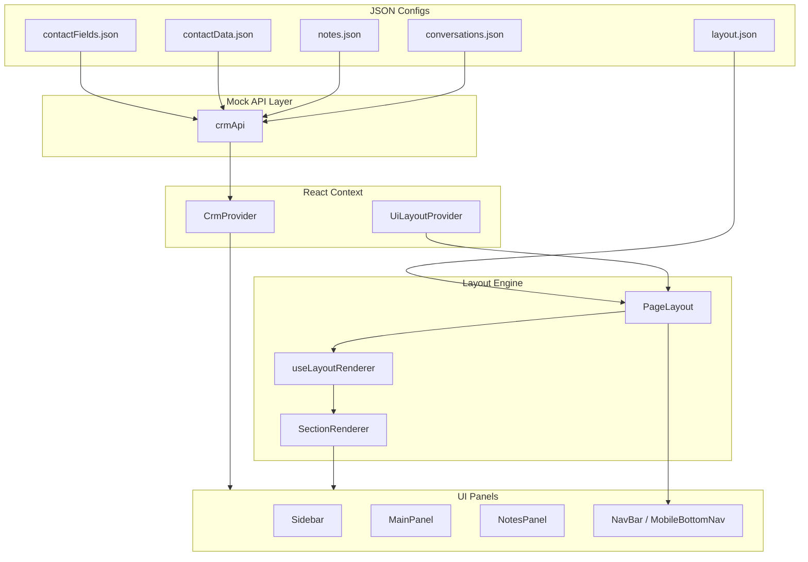
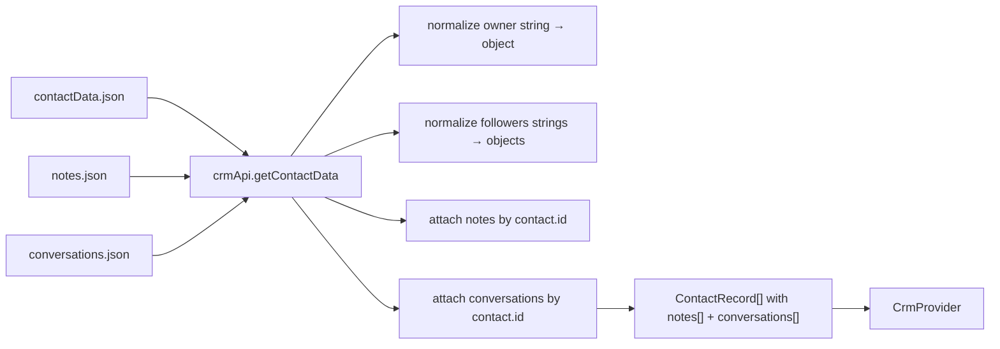
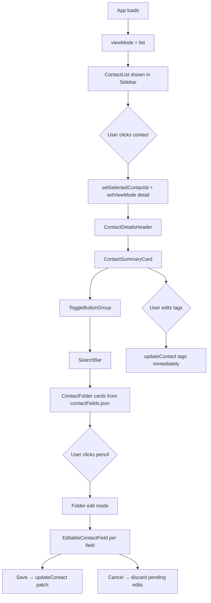
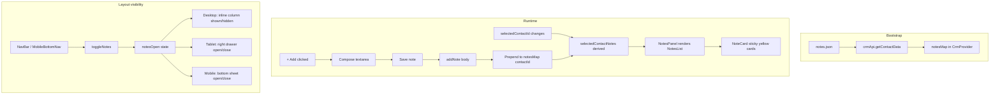
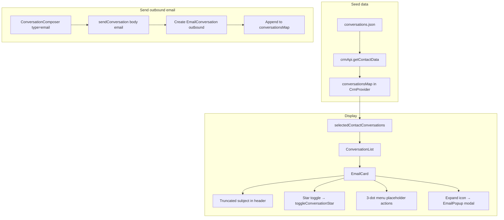
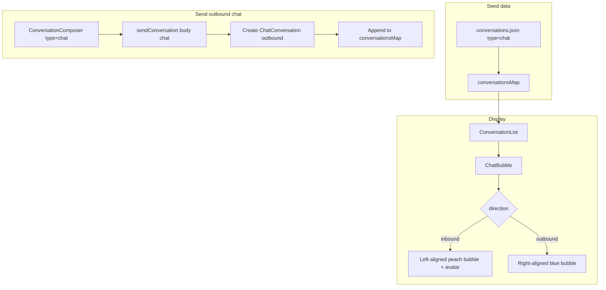
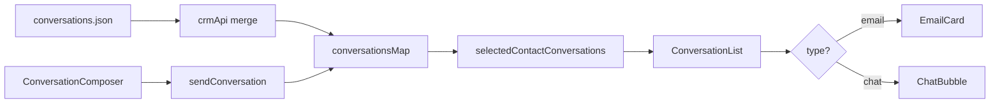

# Pulse CRM

A **config-driven CRM starter** built with React, TypeScript, and Vite. Contact folders, field types, contact values, notes, conversations, and the entire page layout are rendered dynamically from JSON — no hardcoded panel structure or field definitions in JSX.

---

## Table of Contents

1. [Tech Stack](#tech-stack)
2. [Getting Started](#getting-started)
3. [Demo Walkthrough](#demo-walkthrough-start-here)
4. [User Guide](#user-guide)
5. [Hooks & Context Reference](#hooks--context-reference)
6. [UI & Icon Libraries](#ui--icon-libraries)
7. [Project Architecture](#project-architecture)
8. [JSON Configuration System](#json-configuration-system)
9. [Data Bootstrap & State Management](#data-bootstrap--state-management)
10. [Layout System](#layout-system)
11. [Responsive Design](#responsive-design)
12. [Feature Logic Flows](#feature-logic-flows)
   - [Contacts & Sidebar](#contacts--sidebar-flow)
   - [Notes](#notes-flow)
   - [Email](#email-flow)
   - [Chat](#chat-flow)
   - [Conversations (combined timeline)](#conversations-combined-timeline)
13. [Field Renderer System](#field-renderer-system)
14. [Project Structure](#project-structure)
15. [Key Design Principles](#key-design-principles)

---

## Tech Stack

| Layer | Technology |
|-------|------------|
| UI framework | React 19 (functional components only) |
| Language | TypeScript |
| Build | Vite |
| Styling | **Tailwind CSS v4** (utility classes — no separate UI kit like MUI or shadcn) |
| Icons | **Lucide React** (`lucide-react`) — outline icons in NavBar, buttons, composer |
| Animation | Framer Motion (drawers, mobile page transitions) |
| CRM state | React Context (`CrmContext`) + `useCrm()` hook |
| Layout state | React Context (`UiLayoutContext`) + `useUiLayout()` hook |
| Layout engine | `useLayoutRenderer()` hook + `layout.json` |
| Data (mock) | JSON configs + mock API service (`crmApi`) |
| Custom hooks | All live in `src/hooks/` (see [Hooks & Context Reference](#hooks--context-reference)) |

---

## Getting Started

```bash
npm install
npm run dev
```

Open the URL shown in the terminal (usually `http://localhost:5173`).

| Command | Description |
|---------|-------------|
| `npm run dev` | Start development server |
| `npm run build` | Type-check and build for production |
| `npm run preview` | Preview production build |
| `npm run lint` | Run ESLint |

---

## Demo Walkthrough (Start Here)

Use this section when demoing the app to someone. It explains **what to click**, **what appears**, and **how the screen changes** at different sizes.

### One-line pitch

> Pulse CRM is a config-driven CRM demo. Contacts, fields, notes, conversations, and even the page layout come from JSON files. React Context holds the live state; hooks let any panel read that state without prop drilling.

### App startup flow

```
1. Browser loads App.tsx
2. UiLayoutProvider wraps the app (tracks screen size, notes open/closed)
3. ContactDetailsPage loads JSON via crmApi
4. CrmProvider receives contacts + field config
5. PageLayout reads layout.json and draws Sidebar + Main + Notes + NavBar
```

On first load you see the **contact list** on the left. **No contact is selected** — the center says *“No contact selected.”*

### Step-by-step demo script

| Step | You do | What happens |
|------|--------|--------------|
| **1** | Open app (desktop width) | Left: contact list. Center: empty conversations. Right: Notes column (open but empty). Far right: icon NavBar. |
| **2** | Click a contact row | Sidebar → **Contact Details** (avatar, folders, fields). Center → that contact’s **Conversations** (emails + chats). Notes → that contact’s notes. |
| **3** | Scroll center panel | See **EmailCard** (subject, star, expand) and **ChatBubble** (peach inbound / blue outbound) in one timeline. |
| **4** | Type in bottom composer | Pick **chat** or **email** from the left dropdown → type text → click **Send** (or press **Enter**). New message appears in the timeline. |
| **5** | Click expand icon on an email | Full **EmailPopup** modal opens with complete subject and body. |
| **6** | Open / close Notes | Desktop: click **Notes** icon in NavBar (4th icon) or **×** in Notes header. Panel shows/hides; MainPanel expands. |
| **7** | Add a note | In Notes panel → **+ Add** → type → **Save note**. Yellow note card appears at top. |
| **8** | Go back to list | Click **← Contact Details** in sidebar header. List view returns. |
| **9** | Resize browser | See [Responsive Design](#responsive-design) — layout switches automatically. |

### How to see conversations

Conversations **only load after you select a contact**:

1. Click any name in the **Contacts** list (left sidebar).
2. The center **MainPanel** header shows **Conversations**.
3. The timeline shows seeded emails and chats from `conversations.json` for that contact ID.
4. Use the **composer at the bottom** to send new chat or email messages.

If no contact is selected, MainPanel shows *“No contact selected.”* and the composer is not useful until you pick someone.

### How to open Notes

| Screen size | How to open Notes | How it looks |
|-------------|-------------------|--------------|
| **Desktop** (≥1024px) | NavBar **Notes** icon (4th) or Notes panel already open by default | Third column inline on the right (288px) |
| **Tablet** (768–1023px) | NavBar **Notes** icon | **Slide-over drawer** from the right (380px) with dark backdrop |
| **Mobile** (<768px) | Bottom nav **Notes** tab | **Bottom sheet** (85% viewport height) sliding up from bottom |

Close Notes: panel **×** button, backdrop click, or **Esc** (drawer modes).

### How to send email or chat

1. **Select a contact** first.
2. In the **ConversationComposer** (bottom of center panel):
   - Click the **type dropdown** (left side) → choose **chat** or **email**.
   - Type your message in the text field.
   - Click the blue **Send** button (or press **Enter**).
3. **Chat** → appears as a blue outbound bubble on the right.
4. **Email** → appears as a new **EmailCard** with subject derived from the first 80 characters of your text.

The **AI sparkles** button is a placeholder (disabled until text is entered; not wired to a service yet).

### NavBar icons (desktop & tablet)

The right rail shows 5 icon-only buttons with **hover tooltips**:

| Icon | Label | Works today? |
|------|-------|--------------|
| History | History | Placeholder |
| Network | Network | Placeholder |
| FileCheck | Tasks | Placeholder |
| FileText | **Notes** | **Yes** — toggles Notes panel/drawer |
| Calendar | Calendar | Placeholder |

---

## User Guide

### First load

When the site first opens (desktop viewport):

1. **Contact list** is shown in the left sidebar — no contact is pre-selected.
2. The **center panel** shows *“No contact selected.”* until you pick a contact.
3. The **Notes panel** is open by default on desktop (inline, right column), but notes are empty until a contact is selected.
4. The **right NavBar** (5 icons) is always visible on desktop/tablet.

On **tablet**, Notes starts closed and opens as a slide-over drawer. On **mobile**, the app shows the Conversations tab with a bottom navigation bar — no multi-column layout.

The app starts in `viewMode: 'list'` with `selectedContactId: null`.

### Open a contact

1. Click any row in the **Contacts** list.
2. Sidebar switches to **Contact Details** (summary card, folders, search).
3. Center panel loads that contact’s **Conversations** timeline.
4. Notes panel shows that contact’s notes.

Use **← Contact Details** to return to the list. Use **prev / next** pager to move between contacts.

### Add a contact

1. Click **+ Add** in the contact list header.
2. Fill the modal (fields generated from `contactFields.json`).
3. Submit — new contact is created, selected, and detail view opens.

### Edit contact fields

| Folder | Header icons |
|--------|--------------|
| **Contact** | **+** and **pencil** |
| **Additional Info** | **pencil** only |
| **Used Car Buyer Preferences** | **pencil** only |

Click **pencil** → edit fields inline → **Save** / **Cancel** in folder header. Tags are edited separately on the summary card (**+ Add** / **×** on tag pills).

### Notes

- **Desktop:** NavBar 4th icon or panel **×** toggles inline Notes column.
- **Tablet:** NavBar opens right slide-over drawer.
- **Mobile:** Notes tab opens bottom sheet.
- **Add note:** **+ Add** → compose → **Save note**.

### Send chat or email

1. Select a contact (Conversations panel visible).
2. Choose **chat** or **email** from the composer type dropdown.
3. Type message → **Send** or **Enter** (disabled until text entered).

### Email popup

Click the **expand icon** on an email card header to open the full `EmailPopup` modal.

---

## Hooks & Context Reference

All custom hooks live in **`src/hooks/`**. Import them from `@/hooks` (they are also re-exported from `@/context` for backward compatibility).

```tsx
import { useCrm, useUiLayout, useBreakpoint, useLayoutRenderer } from '@/hooks';
```

### Hooks overview

| Hook | File | Uses Context? | Purpose |
|------|------|---------------|---------|
| **`useCrm()`** | `src/hooks/useCrm.ts` | **`CrmContext`** | Read/update CRM data: contacts, selection, notes, conversations, edits |
| **`useUiLayout()`** | `src/hooks/useUiLayout.ts` | **`UiLayoutContext`** | Read/update UI layout: breakpoint mode, notes open, mobile tab |
| **`useLayoutRenderer(config)`** | `src/hooks/useLayoutRenderer.ts` | **`UiLayoutContext`** (via `useUiLayout`) | Turn `layout.json` into inline / drawer / page sections for current screen |
| **`useBreakpoint()`** | `src/hooks/useBreakpoint.ts` | **None** (standalone) | Return `'desktop' \| 'tablet' \| 'mobile'` from window width + `layout.json` breakpoints |

### Context providers

| Provider | File | Wraps | Hook to consume |
|----------|------|-------|-----------------|
| **`UiLayoutProvider`** | `src/context/UiLayoutContext.tsx` | Entire app (`App.tsx`) | `useUiLayout()` |
| **`CrmProvider`** | `src/context/CrmContext.tsx` | Page content (`ContactDetailsPage.tsx`) | `useCrm()` |

**Rule of thumb:** CRM business data → `useCrm()`. Screen layout / panels / drawers → `useUiLayout()`. Layout section math → `useLayoutRenderer()`.

### Which components use which hook

| Hook | Example consumers |
|------|-------------------|
| `useCrm()` | `Sidebar`, `ContactList`, `ContactFolder`, `ContactSummaryCard`, `MainPanel`, `NotesPanel`, `ConversationComposer`, `EmailCard`, `ChatBubble` |
| `useUiLayout()` | `NavBar`, `NotesPanel`, `PageLayout`, `MobileBottomNav`, `ContactDetailsPage` |
| `useLayoutRenderer()` | `PageLayout` only |
| `useBreakpoint()` | Optional — use when you only need screen size without notes/mobile tab state |

### Context state at a glance

**`CrmContext`** owns: `contacts`, `selectedContactId`, `selectedContact`, `selectedContactNotes`, `selectedContactConversations`, `viewMode`, `fieldsConfig`, `openFolders`, `searchTerm`, and actions like `addNote`, `sendConversation`, `updateContact`.

**`UiLayoutContext`** owns: `layoutMode`, `notesOpen`, `toggleNotes`, `mobileSection`, `setMobileSection`, `sidebarCollapsed`.

---

## UI & Icon Libraries

### UI styling — Tailwind CSS (no component library)

Pulse CRM does **not** use Material UI, Ant Design, shadcn/ui, or Chakra. All UI is built with:

- **Tailwind CSS v4** utility classes (`flex`, `rounded-xl`, `text-slate-500`, etc.)
- Plain HTML elements (`button`, `input`, `aside`, `nav`)
- Custom React components in `src/components/`

This keeps the bundle small and full control over the CRM look (white cards, blue accents, yellow note cards, peach chat bubbles).

### Icons — Lucide React

All icons use **`lucide-react`** (tree-shaken — only imported icons are bundled).

| Area | Example Lucide icons |
|------|----------------------|
| NavBar | `History`, `Network`, `FileCheck`, `FileText`, `Calendar` |
| Mobile bottom nav | `User`, `MessageCircle`, `FileText`, `Settings` |
| Composer | `Mail`, `MessageCircle`, `Send`, `Sparkles`, `ChevronDown` |
| Contact UI | `Search`, `Pencil`, `Plus`, `Phone`, `ChevronDown`, `ArrowLeft` |
| Email UI | `Reply`, `Star`, `Maximize2`, `EllipsisVertical`, `X` |

Icons accept Tailwind size classes (`className="h-5 w-5"`) and `strokeWidth` for outline weight.

### Animation — Framer Motion

Used for:

- **ResponsiveDrawer** — slide-in from right (tablet) or bottom (mobile)
- **MobileShell** — fade/slide when switching Contacts ↔ Chat tabs

Respects `prefers-reduced-motion`.

---

## Project Architecture

Pulse CRM is built in three layers: **config**, **state**, and **UI**.



### Startup sequence

1. **`main.tsx`** — mounts `App`, loads Tailwind globals.
2. **`App.tsx`** — wraps app in **`UiLayoutProvider`** (layout/UI state).
3. **`ContactDetailsPage`** — calls `crmApi.getContactFields()` + `crmApi.getContactData()`, seeds **`CrmProvider`**, renders **`PageLayout`**.
4. **`PageLayout`** — reads `layout.json` via **`useLayoutRenderer`**, renders the correct shell for the current breakpoint.
5. **`SectionRenderer`** — maps config section names to React components via **`sectionRegistry`**.

### Dual context model

| Context | Owns | Used by |
|---------|------|---------|
| **`UiLayoutContext`** | `layoutMode`, `notesOpen`, `mobileSection`, `sidebarCollapsed` | NavBar, PageLayout, NotesPanel, MobileBottomNav |
| **`CrmContext`** | contacts, selection, notes map, conversations map, edit actions | Sidebar, MainPanel, NotesPanel, all CRM components |

Layout state and CRM business logic are intentionally separated so responsive behavior never couples to contact data. Components access each context through hooks in **`src/hooks/`** (`useCrm`, `useUiLayout`).

---

## JSON Configuration System

All static data and UI structure live in **`src/configs/`**. Components never import JSON directly — they receive data through **`crmApi`** or context.

### Config files overview

| File | Purpose | Consumed by |
|------|---------|-------------|
| `contactFields.json` | Folder + field definitions (UI structure) | `crmApi.getContactFields()` → `CrmProvider.fieldsConfig` |
| `contactData.json` | Contact records (core profile data only) | `crmApi.getContactData()` (merged) |
| `notes.json` | Notes keyed by contact ID | `crmApi.getContactData()` (merged) |
| `conversations.json` | Emails + chats keyed by contact ID | `crmApi.getContactData()` (merged) |
| `layout.json` | Responsive page layout (desktop/tablet/mobile) | `PageLayout` via `useLayoutRenderer` |

All configs are exported from **`src/configs/index.ts`** and typed in **`src/types/crm.types.ts`**.

---

### `contactFields.json` — UI structure

Defines **what** to render in the sidebar: folders, field labels, field types, and folder behavior.

```json
{
  "folders": [
    {
      "id": "contact",
      "name": "Contact",
      "collapsible": true,
      "addable": true,
      "defaultOpen": true,
      "fields": [
        { "key": "firstName", "label": "First Name", "type": "text", "placeholder": "Enter first name" },
        { "key": "email", "label": "Email", "type": "email", "placeholder": "name@example.com" }
      ]
    }
  ]
}
```

| Folder property | Description |
|-----------------|-------------|
| `id` | Unique folder identifier (used for `openFolders` state) |
| `name` | Display title in sidebar |
| `collapsible` | Show collapse chevron |
| `addable` | Show **+** icon in folder header (Contact folder only) |
| `defaultOpen` | Initial expanded/collapsed state |
| `fields[]` | Array of field definitions |

| Field property | Description |
|----------------|-------------|
| `key` | Must match a property on the contact record in `contactData.json` |
| `label` | Display label |
| `type` | Selects renderer component (`text`, `email`, `phone`, etc.) |
| `placeholder` | Input placeholder in edit mode |
| `options` | For `multiSelect` / `radio` field types |

**How it flows to UI:**

```
contactFields.json
       │
       ▼
crmApi.getContactFields()
       │
       ▼
CrmProvider.fieldsConfig
       │
       ▼
Sidebar → ContactFolder[] → FieldRenderer → typed field component
```

**How to add a new field:**

1. Add the field to the appropriate folder in `contactFields.json`.
2. Add a matching property key on each contact in `contactData.json`.
3. If it's a new type, register a component in `fieldMapper.ts` (see [Field Renderer System](#field-renderer-system)).

**How to add a new folder:**

1. Add a new folder object to `contactFields.json` with a unique `id`.
2. Add corresponding field keys to contact records in `contactData.json`.

---

### `contactData.json` — Contact records

Stores **core contact profile data only**. Notes and conversations are kept in separate files.

```json
{
  "contacts": [
    {
      "id": 1,
      "firstName": "Olivia",
      "lastName": "John",
      "phone": "(555) 123-4567",
      "email": "olivia.perry@example.com",
      "address": "123 Maple Street, Springfield, IL 62704. USA.",
      "businessName": "ABC Corp",
      "streetAddress": "123 Main Street",
      "city": "Springfield",
      "country": "United States",
      "preferredMake": ["toyota", "honda"],
      "budget": "25kto50k",
      "owner": "Devon Lane",
      "followers": ["Aaron", "Bella"],
      "tags": ["Shared Contact", "VIP"]
    }
  ]
}
```

| Field | Type in JSON | Normalized at runtime |
|-------|--------------|----------------------|
| `owner` | string | `{ id, name }` object |
| `followers` | string[] | `{ id, name }[]` array |
| `tags` | string[] | string[] (unchanged) |
| Custom fields | any | Passed through to `ContactRecord` |

**How to add a new contact:**

1. Add a new object to `contacts[]` with a unique `id`.
2. Include all field keys referenced in `contactFields.json`.
3. Add entries for that contact ID in `notes.json` and `conversations.json` (can be empty arrays).

---

### `notes.json` — Per-contact notes

Notes are stored separately and keyed by contact ID:

```json
{
  "notesByContactId": {
    "1": [
      {
        "id": "n1-1",
        "body": "Site inspection completed. Customer satisfied with quote.",
        "createdAt": "2026-05-21T08:00:00.000Z",
        "author": "Aaron"
      }
    ],
    "2": [],
    "4": []
  }
}
```

| Note property | Description |
|---------------|-------------|
| `id` | Unique note identifier |
| `body` | Note text content |
| `createdAt` | ISO 8601 timestamp |
| `author` | Optional author name |

**How to add seed notes for a contact:**

Add or extend the array under `"notesByContactId": { "<contactId>": [...] }`.

At runtime, `crmApi.getContactData()` merges these into each contact's `notes[]` array before passing to `CrmProvider`.

---

### `conversations.json` — Per-contact emails & chats

Conversations are stored separately and keyed by contact ID:

```json
{
  "conversationsByContactId": {
    "1": [
      {
        "id": "c1-1",
        "type": "email",
        "direction": "inbound",
        "subject": "Follow up on shipment delay",
        "to": "Me",
        "body": "Hey John,\n\nYour order has arrived...",
        "threadCount": 3,
        "starred": true,
        "trackUrl": "#",
        "sender": { "name": "Olivia John" },
        "createdAt": "2026-05-22T08:00:00.000Z"
      },
      {
        "id": "c1-2",
        "type": "chat",
        "direction": "inbound",
        "body": "Please let me know",
        "sender": { "name": "Olivia" },
        "createdAt": "2026-05-22T08:15:00.000Z"
      }
    ]
  }
}
```

**Email conversation fields:**

| Field | Required | Description |
|-------|----------|-------------|
| `type` | yes | `"email"` |
| `direction` | yes | `"inbound"` or `"outbound"` |
| `subject` | yes | Email subject line |
| `body` | yes | Email body text |
| `to` | yes | Recipient display (e.g. `"Me"`) |
| `sender.name` | yes | Sender display name |
| `createdAt` | yes | ISO 8601 timestamp |
| `threadCount` | no | Shows centered badge when > 1 |
| `starred` | no | Star toggle state |
| `trackUrl` | no | Tracking link |

**Chat conversation fields:**

| Field | Required | Description |
|-------|----------|-------------|
| `type` | yes | `"chat"` |
| `direction` | yes | `"inbound"` or `"outbound"` |
| `body` | yes | Message text |
| `sender.name` | yes | Sender display name |
| `createdAt` | yes | ISO 8601 timestamp |

**How to add seed conversations:**

Add entries under `"conversationsByContactId": { "<contactId>": [...] }`.

---

### `layout.json` — Responsive page layout

Controls panel widths, order, visibility, and responsive behavior across three breakpoints.

```json
{
  "breakpoints": { "mobile": 768, "tablet": 1024 },
  "desktop": {
    "type": "flex",
    "navPosition": "right",
    "sections": [
      { "id": "sidebar", "component": "Sidebar", "width": "320px", "order": 1, "mode": "inline" },
      { "id": "main", "component": "MainPanel", "flex": 1, "order": 2, "mode": "inline" },
      { "id": "notes", "component": "NotesPanel", "width": "288px", "order": 3, "mode": "inline" }
    ]
  },
  "tablet": { "...": "sidebar + main inline; notes as drawer" },
  "mobile": { "...": "stacked pages + bottom nav; notes as bottom sheet" }
}
```

See [Layout System](#layout-system) and [Responsive Design](#responsive-design) for full details.

---

### How JSON merge works (`crmApi.getContactData`)

Components never read JSON files directly. The mock API merges everything:



Implementation in `src/services/api.ts`:

```typescript
const normalizedContacts = contactData.contacts.map((contact, idx) => ({
  ...contact,
  owner: normalizeOwner(contact.owner, idx + 1),       // "Devon Lane" → { id, name }
  followers: normalizeFollowers(contact.followers),       // ["Aaron"] → [{ id, name }]
  notes: notesByContactId[String(contact.id)] ?? [],
  conversations: conversationsByContactId[String(contact.id)] ?? [],
}));
```

After bootstrap, `CrmProvider` splits notes and conversations into **per-contact maps** in memory. All runtime mutations (add note, send message) update these maps — not the JSON files.

---

## Data Bootstrap & State Management

### Bootstrap flow (page load)

```
1. ContactDetailsPage mounts
2. crmApi.getContactFields()  →  fieldsConfig
3. crmApi.getContactData()    →  contacts[] (merged from 3 JSON files)
4. CrmProvider seeds:
     - contacts[]
     - notesMap: Record<contactId, Note[]>
     - conversationsMap: Record<contactId, Conversation[]>
     - viewMode: 'list', selectedContactId: null
5. PageLayout reads layout.json → renders panels
```

### CrmContext state

| State | Type | Purpose |
|-------|------|---------|
| `contacts` | `ContactRecord[]` | All contact records |
| `fieldsConfig` | `ContactFieldsConfig` | From `contactFields.json` |
| `selectedContactId` | `number \| null` | Active contact (`null` on first load) |
| `selectedContact` | `ContactRecord \| null` | Derived from selection |
| `selectedContactNotes` | `Note[]` | Notes for selected contact |
| `selectedContactConversations` | `Conversation[]` | Conversations for selected contact |
| `viewMode` | `'list' \| 'detail'` | Sidebar list vs detail view |
| `activeTab` | `'allFields' \| 'dnd' \| 'actions'` | Sidebar tab |
| `openFolders` | `Record<string, boolean>` | Folder expand/collapse |
| `searchTerm` | `string` | Sidebar search filter |

### CrmContext actions

| Action | Method | Effect |
|--------|--------|--------|
| Select contact | `setSelectedContactId(id)` + `setViewMode('detail')` | Opens detail, notes, conversations |
| Back to list | `setViewMode('list')` | Shows contact list |
| Edit contact fields | `updateContact(patch)` | Merges patch into selected contact |
| Add contact | `addContact(data)` | Creates contact + empty notes/conversations maps |
| Add note | `addNote(body)` | Prepends note to active contact's `notesMap` |
| Send message | `sendConversation(body, type)` | Appends email/chat to active contact's `conversationsMap` |
| Star email | `toggleConversationStar(id)` | Toggles `starred` on email in map |
| Prev/Next | `goToPrev()` / `goToNext()` | Cycles selected contact |

### UiLayoutContext state

```tsx
const {
  layoutMode,        // 'desktop' | 'tablet' | 'mobile'
  notesOpen,         // inline panel / drawer open state
  toggleNotes,       // flip notesOpen
  openNotes,
  closeNotes,
  mobileSection,     // active mobile tab: 'sidebar' | 'main'
  setMobileSection,
  sidebarCollapsed,  // future-ready
  toggleSidebar,
} = useUiLayout();  // import from '@/hooks' or '@/context'
```

| Behavior | Detail |
|----------|--------|
| `notesOpen` default | `true` on desktop, auto-closes when resizing to tablet/mobile |
| NavBar toggle | 4th icon calls `toggleNotes()` |
| NotesPanel × button | Calls `closeNotes()` via context |
| Desktop inline notes | Hidden from flex row when `notesOpen === false` |
| Tablet/mobile notes | Shown inside `ResponsiveDrawer` when `notesOpen === true` |

---

## Layout System

The page layout is **fully config-driven**. Panel widths, order, visibility, and responsive behavior come from `layout.json` — not hardcoded JSX.

### Layout engine pipeline

```
layout.json
    ↓
useLayoutRenderer()     ← reads layoutMode from UiLayoutContext
    ↓
PageLayout              ← DesktopShell (desktop/tablet) or MobileShell (mobile)
    ↓
SectionRenderer         ← looks up component in sectionRegistry
    ↓
Sidebar / MainPanel / NotesPanel
```

| File | Role |
|------|------|
| `src/configs/layout.json` | Breakpoints, sections, drawer config per mode |
| `src/hooks/useLayoutRenderer.ts` | Normalizes config → sections split by `inline` / `drawer` / `page` |
| `src/layouts/PageLayout.tsx` | Generic shell — flex workspace, drawers, mobile stack |
| `src/layouts/SectionRenderer.tsx` | Applies width/flex styles; renders registered component |
| `src/layouts/sectionRegistry.ts` | `"Sidebar"` → `<Sidebar />`, etc. |
| `src/layouts/ResponsiveDrawer.tsx` | Animated slide-over / bottom sheet |
| `src/layouts/MobileBottomNav.tsx` | Fixed bottom tab bar (mobile) |

### Section registry

`SectionRenderer` never hardcodes panel components. It looks up the `component` string from config:

```typescript
// src/layouts/sectionRegistry.ts
export const SECTION_REGISTRY = {
  Sidebar,
  MainPanel,
  NotesPanel,
};
```

**To add a new panel:**

1. Create the React component.
2. Register in `sectionRegistry.ts`.
3. Add a section entry to each mode block in `layout.json`.

### Section modes

| Mode | Used on | Behavior |
|------|---------|----------|
| `"inline"` | Desktop, Tablet | Rendered in the main flex row |
| `"drawer"` | Tablet, Mobile | Hidden until opened; inside `ResponsiveDrawer` |
| `"page"` | Mobile | Full-screen tab; one visible at a time |

### Section config fields

| Field | Description |
|-------|-------------|
| `id` | Unique section identifier |
| `component` | Key in `sectionRegistry.ts` |
| `width` | Fixed width (e.g. `"320px"`) |
| `minWidth` | Minimum width constraint |
| `flex` | Flex grow (e.g. `1` for MainPanel) |
| `visible` | Whether section participates in layout |
| `order` | Render order (lower = further left) |
| `mode` | `"inline"` \| `"drawer"` \| `"page"` |

### Current layout by breakpoint

| Section | Desktop (≥1024px) | Tablet (768–1023px) | Mobile (<768px) |
|---------|-------------------|---------------------|-----------------|
| Sidebar | inline, 320px | inline, 300px | page tab (Contacts) |
| MainPanel | inline, flex:1 | inline, flex:1 | page tab (Chat, default) |
| NotesPanel | inline, 288px | drawer, right 380px | drawer, bottom 85vh |
| Navigation | NavBar (right rail) | NavBar (right rail) | MobileBottomNav |

### Drawer config

```json
"drawer": {
  "position": "right",
  "width": "380px",
  "height": "85vh",
  "overlay": true
}
```

Drawer features: Framer Motion spring animation, backdrop click to close, **Esc** to close, focus trap, `prefers-reduced-motion` support.

---

## Responsive Design

How the UI adapts when you resize the browser. Breakpoints come from **`layout.json`**; **`UiLayoutContext`** tracks the current mode on `window.resize`; **`useLayoutRenderer()`** picks the right section layout.

### Breakpoint rules

```json
"breakpoints": { "mobile": 768, "tablet": 1024 }
```

| Viewport width | `layoutMode` | What you see |
|----------------|--------------|--------------|
| **≥ 1024px** | `desktop` | 3 columns side-by-side + right NavBar |
| **768px – 1023px** | `tablet` | 2 columns (Sidebar + Main) + NavBar; Notes in **right popover drawer** |
| **< 768px** | `mobile` | **One full screen at a time** + bottom tabs; Notes in **bottom sheet** |

When you cross a breakpoint, `notesOpen` auto-closes on tablet/mobile (Notes is no longer an inline column).

### Desktop (≥ 1024px) — 3-column workspace

```
┌──────────────────────────────────────────────────────────────┬────┐
│  Sidebar (320px)    MainPanel (flex-1)    Notes (288px)    │Nav │
│  Contact list OR    Conversations +         Notes list       │Bar │
│  Contact Details    composer at bottom      + Add note       │5   │
│  white card         white card              white card       │icons│
└──────────────────────────────────────────────────────────────┴────┘
```

- All three panels use `mode: "inline"` in `layout.json`.
- **Notes open by default** on first desktop load.
- NavBar **Notes** icon (4th) or panel **×** toggles the Notes column; MainPanel expands when Notes hides.
- NavBar tooltips appear on hover (History, Network, Tasks, Notes, Calendar).

### Tablet (768px – 1023px) — Notes as right slide-over

```
┌──────────────────────────────────────────────┬────┐
│  Sidebar (300px)    MainPanel (flex-1)       │Nav │
│  (same as desktop)  Conversations + composer │Bar │
└──────────────────────────────────────────────┴────┘

When Notes opens:
                    ┌─────────────────┐
                    │  NotesPanel     │  ← 380px drawer from right
                    │  (overlay dim)  │
                    └─────────────────┘
```

- Sidebar + Main stay **inline**; Notes section uses `mode: "drawer"`.
- Click NavBar **Notes** icon → **`ResponsiveDrawer`** slides in from the **right** with a dark backdrop.
- Click backdrop, **×**, or **Esc** to close.
- `notesOpen` starts **false** when entering tablet width.

### Mobile (< 768px) — one page + bottom tabs

```
┌─────────────────────────────┐
│                             │
│   ONE panel fills screen    │  ← Contacts OR Chat (not both)
│                             │
├─────────────────────────────┤
│ Contacts │ Chat │ Notes │ ⚙ │  ← MobileBottomNav
└─────────────────────────────┘

When Notes tab tapped:
┌─────────────────────────────┐
│  NotesPanel (85vh sheet)    │  ← slides up from bottom
│  ─────────────────────────  │
│  (dimmed content behind)    │
└─────────────────────────────┘
```

- No side-by-side columns. Sections use `mode: "page"` (Contacts sidebar, Chat main).
- **Default tab:** Chat (`defaultSection: "main"` in `layout.json`).
- **Contacts tab** → full-screen contact list / detail (sidebar content).
- **Chat tab** → full-screen conversations + composer.
- **Notes tab** → opens **bottom sheet** drawer (85% viewport height), not a full page swap.
- **Settings tab** → placeholder (no action yet).
- Switching Contacts ↔ Chat uses Framer Motion fade/slide.

### Side-by-side: what changes per breakpoint

| Feature | Desktop | Tablet | Mobile |
|---------|---------|--------|--------|
| Columns visible | 3 inline | 2 inline | 1 page at a time |
| Conversations | Center column (after contact selected) | Same | **Chat** bottom tab |
| Notes | Inline right column | **Right drawer** (popover) | **Bottom sheet** |
| Navigation | Right NavBar (5 icons + tooltips) | Right NavBar | Bottom tab bar (4 tabs) |
| Notes default | Open | Closed | Closed |
| Select contact | Click list row | Same | **Contacts** tab → click row |

### Navigation by breakpoint

| Breakpoint | Navigation | Notes access |
|------------|------------|--------------|
| Desktop | Right NavBar: History, Network, Tasks, **Notes**, Calendar | Inline panel; **Notes** icon toggles |
| Tablet | Same NavBar | **Notes** icon → right slide-over drawer |
| Mobile | Bottom tabs: **Contacts**, **Chat**, **Notes**, Settings | **Notes** tab → bottom sheet |

---

## Feature Logic Flows

### Contacts & Sidebar Flow



**Sidebar component tree:**

```
Sidebar
├── ContactList              (viewMode = 'list')
└── Contact detail view      (viewMode = 'detail')
    ├── ContactDetailsHeader (back arrow, pager)
    ├── ContactSummaryCard   (avatar, owner, followers, tags)
    ├── ToggleButtonGroup    (All Fields | DND | Actions)
    ├── SearchBar            (filters folders + fields)
    └── ContactFolder[]      (from contactFields.json)
        └── EditableContactField / read-only display
```

**Add contact flow:**

```
ContactList → + Add → AddContactModal
  → form fields generated from contactFields.json
  → submit → addContact() → auto-select → detail view
```

---

### Notes Flow



**Notes data path:**

```
notes.json (notesByContactId)
    → crmApi.getContactData() merges into contact.notes[]
    → CrmProvider builds notesMap: Record<contactId, Note[]>
    → selectedContactNotes = notesMap[selectedContactId]
    → NotesPanel → NotesList → NoteCard[]
```

**Adding a note at runtime:**

1. User clicks **+ Add** in NotesPanel.
2. Types in compose textarea.
3. Clicks **Save note** → `addNote(body)`.
4. Creates `{ id: "note-{timestamp}", body, createdAt }`.
5. Prepends to `notesMap[selectedContactId]`.
6. UI updates immediately (newest note first).

**Notes are never written back to JSON** — changes live in React state for the session.

---

### Email Flow



**Email card features:**

| Feature | Behavior |
|---------|----------|
| Subject | Truncated in card; full text in popup |
| Thread badge | Centered circle when `threadCount > 1` |
| Star | Toggle persisted in `conversationsMap` for session |
| Expand | Opens `EmailPopup` with full subject, body, actions |
| Reply / ⋮ menu | UI placeholders (Forward, Archive, etc.) |
| Inbound avatar | Uses selected contact's name for avatar color/initials |

**Sending an outbound email:**

1. User selects **email** in composer type dropdown.
2. Types message → clicks **Send**.
3. `sendConversation(text, 'email')` creates:
   ```typescript
   {
     id: "conv-{timestamp}",
     type: "email",
     direction: "outbound",
     subject: first 80 chars of body,
     body: text,
     to: "{contact firstName lastName}",
     sender: { name: "Me" },
     createdAt: ISO timestamp
   }
   ```
4. Appended to `conversationsMap[selectedContactId]`.
5. `EmailCard` renders in timeline.

---

### Chat Flow



**Chat bubble styling:**

| Direction | Layout | Style |
|-----------|--------|-------|
| **Inbound** | Left-aligned with contact avatar | `#fff3e4` background, speech-bubble tail, sender name + timestamp |
| **Outbound** | Right-aligned | Blue bubble (`bg-blue-600`), no avatar |

**Sending an outbound chat:**

1. User selects **chat** in composer (default).
2. Types message → **Send** or **Enter**.
3. `sendConversation(text, 'chat')` creates outbound `ChatConversation`.
4. Appended to timeline; `ChatBubble` renders on the right.

---

### Conversations (combined timeline)

Emails and chats share one chronological timeline per contact.



**Component tree:**

```
MainPanel
├── Header ("Conversations")
├── ConversationList
│   ├── EmailCard[]     (type === 'email')
│   └── ChatBubble[]    (type === 'chat')
└── ConversationComposer
    ├── Type selector   (chat | email dropdown)
    ├── Text input
    ├── AI button       (sparkles icon, placeholder — disabled until text)
    └── Send button     (disabled until text)
```

**Conversation type discrimination:**

```typescript
// src/types/crm.types.ts
type Conversation = EmailConversation | ChatConversation;

// EmailConversation: type 'email', subject, to, threadCount?, starred?
// ChatConversation:  type 'chat', body only
```

`ConversationList` checks `conv.type` and renders the matching component. Both types coexist in the same array sorted by load order (chronological as stored in JSON).

---

## Field Renderer System

Fields are rendered dynamically using a **type → component map** in `src/utils/fieldMapper.ts`:

```
contactFields.json
       │
       ▼
  ContactFolder  ──►  ContactField  ──►  FieldRenderer
                                                │
                                    getFieldComponent(field.type)
                                                │
                    ┌───────────────────────────┼───────────────────────────┐
                    ▼                           ▼                           ▼
               TextField                   PhoneField                   EmailField
               AddressField                MultiSelectField             RadioField
               TagsField                   AvatarSelectField
```

| Type | Component | Display |
|------|-----------|---------|
| `text` | `TextField` | Label + value |
| `email` | `EmailField` | Mailto link |
| `phone` | `PhoneField` | Flag + number + call button |
| `address` | `AddressField` | Multi-line address |
| `multiSelect` | `MultiSelectField` | Chip list |
| `radio` | `RadioField` | Selected option badge |
| `tags` | `TagsField` | Tag pills |
| `avatarSelect` | `AvatarSelectField` | Avatar + name chip |

**To add a new field type:**

1. Create component in `src/components/contact/fields/`.
2. Register in `fieldComponentMap` in `fieldMapper.ts`.
3. Add type to `FieldType` union in `crm.types.ts`.
4. Use the new type in `contactFields.json`.

---

## Project Structure

```
src/
├── App.tsx                    # UiLayoutProvider wrapper
├── main.tsx                   # React entry point
│
├── pages/
│   └── ContactDetailsPage.tsx # Bootstrap data → CrmProvider → PageLayout
│
├── context/
│   ├── CrmContext.tsx         # CrmProvider + CrmContext (no hook — see hooks/useCrm.ts)
│   ├── UiLayoutContext.tsx    # UiLayoutProvider + UiLayoutContext
│   └── index.ts               # Re-exports providers + hooks
│
├── hooks/                     # All custom hooks
│   ├── useCrm.ts              # CRM state reader (uses CrmContext)
│   ├── useUiLayout.ts         # Layout state reader (uses UiLayoutContext)
│   ├── useLayoutRenderer.ts   # layout.json → inline/drawer/page sections
│   ├── useBreakpoint.ts       # Standalone viewport mode (no context)
│   └── index.ts               # Barrel export — import from '@/hooks'
│
├── layouts/                   # Config-driven layout engine
│   ├── PageLayout.tsx         # Responsive shell (desktop/tablet/mobile)
│   ├── SectionRenderer.tsx    # Dynamic section → component renderer
│   ├── sectionRegistry.ts     # "Sidebar" → <Sidebar /> map
│   ├── ResponsiveDrawer.tsx   # Animated slide-over / bottom sheet
│   └── MobileBottomNav.tsx    # Fixed bottom tab bar (mobile)
│
├── services/
│   └── api.ts                 # Mock API — merges JSON configs
│
├── configs/
│   ├── contactFields.json     # Folder + field UI definitions
│   ├── contactData.json       # Contact profile records
│   ├── notes.json             # Notes keyed by contactId
│   ├── conversations.json     # Emails + chats keyed by contactId
│   └── layout.json            # Responsive layout (desktop/tablet/mobile)
│
├── components/
│   ├── contact/               # Sidebar: folders, fields, list, modals
│   │   └── fields/            # Typed field renderers
│   ├── conversations/         # EmailCard, ChatBubble, Composer, EmailPopup
│   ├── layout/                # Sidebar, MainPanel, NotesPanel, NavBar
│   └── notes/                 # NoteCard, NotesList
│
├── types/
│   └── crm.types.ts           # All TypeScript interfaces
│
├── utils/
│   ├── fieldMapper.ts         # Field type → component map
│   └── formatters.ts          # Dates, avatars, display helpers
│
└── styles/
    └── globals.css            # Tailwind + global styles
```

Path aliases: `@/` maps to `src/`.

---

## Key Design Principles

1. **Config over code** — Folders, fields, values, notes, conversations, and page layout come from JSON.
2. **Separation of data files** — Contact profiles, notes, and conversations are separate JSON files merged at API layer.
3. **Separation of layout vs business state** — `UiLayoutContext` owns breakpoints/notes/nav; `CrmContext` owns CRM data.
4. **Composition over prop drilling** — Panels consume `useCrm()` and `useUiLayout()` from `@/hooks`.
5. **Responsive by configuration** — Desktop/tablet/mobile behavior defined in `layout.json`.
6. **Extensible section registry** — New panels = one registry entry + one config block.
7. **Per-contact scoping** — Notes and conversations keyed by contact ID; switching contacts updates all panels.
8. **Runtime mutations in memory** — Add note, send message, edit contact update React state, not JSON files.

---

## License

Private project — see repository owner for usage terms.
