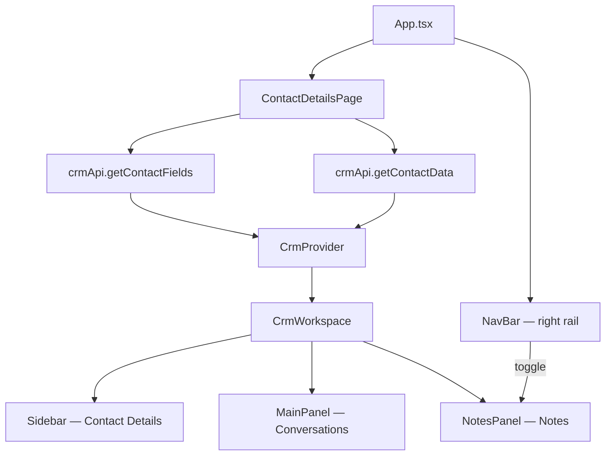

# Pulse CRM

A **config-driven CRM starter** built with React, TypeScript, and Vite. The UI is not hardcoded — contact folders, field types, and values are rendered dynamically from JSON configuration files.

---

## Tech Stack

| Layer | Technology |
|-------|------------|
| UI | React 19 (functional components only) |
| Language | TypeScript |
| Build | Vite |
| Styling | Tailwind CSS v4 |
| State | React Context (`CrmContext`) |
| Data (mock) | JSON configs + mock API service |

---

## Getting Started

```bash
npm install
npm run dev
```

Open the URL shown in the terminal (usually `http://localhost:5173`).

---

## User Guide

This section describes what you see and how to use the app after it loads.

### First load

When the site first opens:

1. **Contact list** is shown in the left sidebar — no contact is pre-selected.
2. The **center panel** shows *“No contact selected.”* until you pick a contact.
3. The **Notes panel** is open by default on large screens, but notes are empty until a contact is selected.
4. The **right NavBar** (5 icons) is always visible.

The app starts in `viewMode: 'list'` with `selectedContactId: null`. Conversations, notes, and contact folders only become active after you select a contact.

### Open a contact

1. In the left sidebar, click any row in the **Contacts** list.
2. The sidebar switches to **Contact Details** (summary card, folders, search).
3. The center panel loads that contact’s **Conversations** timeline.
4. The Notes panel shows that contact’s notes.

To go back to the list, click the **← Contact Details** back arrow in the sidebar header. You can also move between contacts with the **prev / next** pager in the same header.

### Add a contact

1. From the contact list, click the blue **+ Add** button (top right of the sidebar).
2. The **Add Contact** modal opens with fields generated from `contactFields.json`.
3. Fill in the form and submit.
4. The new contact is created, automatically selected, and the sidebar switches to detail view.

### Edit contact fields & Additional Info

Contact folders (**Contact**, **Additional Info**, etc.) are config-driven cards in the sidebar.

**Folder-level edit (recommended):**

1. Open a contact’s detail view.
2. In a folder header, click the **pencil icon** to enter edit mode.
3. Edit field values inline. Press **Enter** to save a single field, or **Escape** to cancel that field.
4. Click **Save** in the folder header to commit all pending changes, or **Cancel** to discard them.

**Folder header icons:**

| Folder | Icons |
|--------|-------|
| **Contact** | **+** (add) and **pencil** (edit) |
| **Additional Info** | **pencil** only |
| **Used Car Buyer Preferences** | **pencil** only |

The **+** button on the Contact folder also enters edit mode (same as pencil). Email fields are validated before save.

**Per-field edit:** While a folder is in edit mode, hover a field label to reveal a small pencil and edit that field individually.

Changes are saved to in-memory state via `updateContact()` — no backend call yet.

### Edit tags

Tags live on the **Contact Summary Card** at the top of the sidebar (below the header).

- **Add a tag:** Click **+ Add** under Tags, type the tag name, then press **Enter** or click away to save.
- **Remove a tag:** Click the **×** on any tag pill.

Tag changes save immediately (unlike folder edits, which use Save/Cancel).

### Access notes

Notes are scoped to the **currently selected contact**.

**Open / close the Notes panel:**

- Click the **4th icon** (document/notes) on the far-right **NavBar** to toggle the panel.
- Or click **×** in the Notes panel header to close it.

When Notes is closed, the Conversations panel expands to fill the space.

**Add a note:**

1. Select a contact.
2. In the Notes panel, click **+ Add**.
3. Type in the yellow compose area.
4. Click **Save note** (or **Cancel** to discard).

Notes appear as sticky yellow cards below the compose area, newest first.

### Send a chat message or email

Sending is only available when a contact is selected (center **Conversations** panel visible).

1. Use the **composer** at the bottom of the Conversations panel.
2. Click the **type selector** on the left (chat bubble or envelope icon) and choose **chat** or **email**.
3. Type your message in the text field.
4. Click the blue **Send** button, or press **Enter**.

**Requirements:**

- Send is **disabled** until the input has text.
- The **sparkles (AI)** button is visible but disabled until text is entered; it is a placeholder (*“Modify with AI (coming soon)”*).

Outbound messages are appended to the active contact’s conversation thread immediately.

### Open an email popup

In the conversation timeline, **email cards** show a truncated subject line.

1. Find an email in the Conversations list.
2. Click the **expand icon** (four outward arrows) in the top-right of the email card header.
3. A full **Email popup** opens with the complete subject, sender, body, and actions.

You can also **star** an email, use **Reply**, or open the **⋮** menu (Forward, Mark unread, Archive, Delete) from the card. Star state is persisted in context for the session.

---

### Scripts

| Command | Description |
|---------|-------------|
| `npm run dev` | Start development server |
| `npm run build` | Type-check and build for production |
| `npm run preview` | Preview production build |
| `npm run lint` | Run ESLint |

---

## Application Flow (High Level)

When the app loads, data flows from JSON configs → mock API → page bootstrap → global context → UI panels.



### Step-by-step startup

1. **`main.tsx`** mounts `App` and loads global styles.
2. **`App.tsx`** renders the shell: workspace + right navigation rail. It owns `notesOpen` (Notes panel visible by default).
3. **`ContactDetailsPage`** fetches config data via `crmApi`, then wraps the workspace in **`CrmProvider`**.
4. **`CrmProvider`** initializes with **`viewMode: 'list'`** and **no selected contact**.
5. **`CrmWorkspace`** renders the three main panels:
   - **Left** — Contact list first; detail view after selection
   - **Center** — Empty state until a contact is selected, then Conversations
   - **Right** — Notes panel (optional, toggled from NavBar)

---

## Layout Architecture

The CRM uses a **3-column workspace** with a fixed **right navigation rail**.

```
┌──────────────────────────────────────────────────────────────┬────┐
│                                                              │    │
│  Contact Details          Conversations          Notes       │ N  │
│  (Sidebar)                (MainPanel)            (Panel)     │ a  │
│  ~320px                   flex-1                 ~300px      │ v  │
│                                                              │    │
└──────────────────────────────────────────────────────────────┴────┘
```

| Panel | Component | Responsibility |
|-------|-----------|----------------|
| Left | `Sidebar` | Contact list / contact detail view, folders, fields |
| Center | `MainPanel` | Mixed email + chat timeline, message composer |
| Right | `NotesPanel` | Per-contact sticky notes (add, close) |
| Far right | `NavBar` | 5-icon nav rail; 4th icon toggles Notes panel |

When Notes is closed, the Conversations panel **expands** to fill the freed space.

---

## Data Flow

### 1. Bootstrap (on page load)

```
contactFields.json  ──►  crmApi.getContactFields()  ──►  field/folder definitions
contactData.json    ──►  crmApi.getContactData()    ──►  contacts + notes + conversations
```

The mock API layer (`src/services/api.ts`) keeps components decoupled from where data comes from. Today it returns JSON; later it can be swapped for a real REST/GraphQL API without changing UI components.

### 2. Global state (`CrmContext`)

After bootstrap, all interactive state lives in **`CrmProvider`**:

| State | Purpose |
|-------|---------|
| `contacts` | All contact records |
| `selectedContactId` | Currently viewed contact (`null` on first load) |
| `selectedContactNotes` | Notes for selected contact only |
| `selectedContactConversations` | Conversations for selected contact only |
| `viewMode` | `'list'` (contact list) or `'detail'` (contact detail) |
| `activeTab` | `'allFields'` \| `'dnd'` \| `'actions'` |
| `openFolders` | Which field folders are expanded |
| `searchTerm` | Filters folders/fields in sidebar |

**Per-contact scoping:** Notes and conversations are stored in maps keyed by `contactId`. Switching contacts automatically updates the Notes panel and Conversations feed.

### 3. User actions → state updates

| Action | Context method | Effect |
|--------|----------------|--------|
| Select contact | `setSelectedContactId` + `setViewMode('detail')` | Opens detail sidebar, conversations, and notes |
| Back arrow in sidebar | `setViewMode('list')` | Returns to contact list |
| Add note | `addNote(body)` | Prepends note to active contact |
| Send message | `sendConversation(body, type)` | Appends email or chat to active contact |
| Star email | `toggleConversationStar(id)` | Toggles starred state on email card |
| Add contact | `addContact(data)` | Creates contact + empty notes/conversations |
| Prev/Next pager | `goToPrev` / `goToNext` | Cycles through contacts |

---

## Config-Driven Contact System

Nothing in the contact sidebar is hardcoded. Two JSON files define structure and values.

### `contactFields.json` — UI structure

Defines **folders** and **fields** (what to render and how):

```json
{
  "folders": [
    {
      "id": "contact",
      "name": "Contact",
      "collapsible": true,
      "addable": true,
      "defaultOpen": true,
      "fields": [
        { "key": "firstName", "label": "First Name", "type": "text" },
        { "key": "phone", "label": "Phone Number", "type": "phone" }
      ]
    }
  ]
}
```

- **`key`** must match a property on the contact record in `contactData.json`.
- **`type`** selects which field component renders (see Field Renderer below).

### `contactData.json` — Contact values

Each contact is a flat record with nested arrays for notes and conversations:

```json
{
  "contacts": [
    {
      "id": 1,
      "firstName": "Olivia",
      "lastName": "John",
      "email": "olivia@example.com",
      "owner": { "id": 1, "name": "Devon Lane" },
      "tags": ["VIP"],
      "notes": [ { "id": "n1", "body": "...", "createdAt": "..." } ],
      "conversations": [ { "id": "c1", "type": "email", "subject": "...", "body": "..." } ]
    }
  ]
}
```

---

## Field Renderer System

Fields are rendered dynamically using a **type → component map** in `src/utils/fieldMapper.ts`:

```
contactFields.json
       │
       ▼
  ContactFolder  ──►  ContactField  ──►  FieldRenderer
                                                │
                                    getFieldComponent(field.type)
                                                │
                    ┌───────────────────────────┼───────────────────────────┐
                    ▼                           ▼                           ▼
               TextField                   PhoneField                   EmailField
               AddressField                MultiSelectField             RadioField
               TagsField                   AvatarSelectField
```

Supported field types:

| Type | Component | Display |
|------|-----------|---------|
| `text` | `TextField` | Label + value |
| `email` | `EmailField` | Mailto link |
| `phone` | `PhoneField` | Flag + number + call button |
| `address` | `AddressField` | Multi-line address |
| `multiSelect` | `MultiSelectField` | Chip list |
| `radio` | `RadioField` | Selected option badge |
| `tags` | `TagsField` | Tag pills |
| `avatarSelect` | `AvatarSelectField` | Avatar + name chip |

To add a new field type: create a component in `src/components/contact/fields/`, register it in `fieldComponentMap`, and add the type to `FieldType` in `crm.types.ts`.

---

## Sidebar Flow (Contact Details)

```
ContactDetailsHeader  (back arrow, title, pager)
        │
        ▼
ContactSummaryCard  (avatar, name, call, owner, followers, tags)
        │
        ▼
ToggleButtonGroup   (All Fields | DND | Actions)
        │
        ▼
SearchBar           (filters folders + fields)
        │
        ▼
ContactFolder[]     (collapsible cards from contactFields.json)
        │
        └──► FieldRenderer → typed field component
```

**Contact list mode (default on load):** The app opens with `viewMode = 'list'` and no contact selected. Click a contact to switch to `viewMode = 'detail'`. The back arrow returns to the list.

**Add contact:** `ContactList` opens `AddContactModal`, which dynamically generates form fields from `contactFields.json`. On save, the new contact is selected and detail view opens.

**Edit folders:** Each folder header has icon-only actions — **+** (Contact folder only) and **pencil** (all folders). Folder edit mode shows **Save** / **Cancel** and inline editable fields. Tags are edited separately on the summary card.

---

## Conversations Flow (Center Panel)

The center panel shows a **mixed timeline** of emails and chats for the selected contact.

```
MainPanel
├── ConversationList
│   ├── EmailCard      (subject, thread badge, star, reply, 3-dot menu, expand popup)
│   └── ChatBubble     (inbound left / outbound right)
└── ConversationComposer
    ├── Type dropdown  (email | chat)
    ├── Text input
    ├── AI button      (disabled until text entered; placeholder only)
    └── Send button    (disabled until text entered)
```

**Email cards** support:
- Truncated subject line with expand-to-popup
- Thread count badge (centered circle when `threadCount > 1`)
- Star toggle (persisted in context)
- Reply button and 3-dot menu (Forward, Mark unread, Archive, Delete)

**Sending a message:** Type in the composer, choose **chat** or **email** from the type dropdown, then click **Send** or press **Enter**. Both Send and the AI button stay disabled until text is entered. `ConversationComposer` calls `sendConversation(body, type)`, which appends an outbound email or chat to the active contact's conversation list.

**Email popup:** Click the expand icon on an email card header to open the full `EmailPopup` modal.

---

## Notes Flow (Right Panel)

```
NotesPanel
├── Header   (title, + Add, × close)
├── Compose  (textarea — shown when Add clicked)
└── NotesList → NoteCard[]  (sticky yellow cards, relative timestamps)
```

- Notes are **scoped per contact** — switching contacts changes the list.
- `+ Add` opens an inline compose area; Save calls `addNote(body)`.
- `×` closes the panel (handled in `App.tsx` via `notesOpen` state).
- NavBar 4th icon also toggles the panel open/closed.

---

## Project Structure

```
src/
├── App.tsx                    # Root shell + notes panel toggle
├── main.tsx                   # React entry point
│
├── pages/
│   └── ContactDetailsPage.tsx # Bootstrap data, CrmProvider, 3-column workspace
│
├── context/
│   └── CrmContext.tsx         # Global CRM state and actions
│
├── services/
│   └── api.ts                 # Mock API (swap for real backend later)
│
├── configs/
│   ├── contactFields.json     # Folder + field definitions
│   ├── contactData.json       # Contacts, notes, conversations
│   ├── layout.json            # Layout section config
│   └── notes.json             # Legacy seed notes (API helper)
│
├── components/
│   ├── contact/               # Sidebar: folders, fields, list, modals
│   │   └── fields/            # Typed field renderers
│   ├── conversations/         # EmailCard, ChatBubble, Composer
│   ├── layout/                # Sidebar, MainPanel, NotesPanel, NavBar
│   └── notes/                 # NoteCard, NotesList
│
├── hooks/
│   └── useLayoutRenderer.ts   # Memoized layout section sorting
│
├── types/
│   └── crm.types.ts           # All TypeScript interfaces
│
├── utils/
│   ├── fieldMapper.ts         # Field type → component map
│   └── formatters.ts          # Dates, avatars, display helpers
│
└── styles/
    └── globals.css            # Tailwind + global styles
```

Path aliases: `@/` maps to `src/` (configured in `vite.config.ts` and `tsconfig.app.json`).

---

## Key Design Principles

1. **Config over code** — Folders, fields, and values come from JSON, not hardcoded JSX.
2. **Composition over prop drilling** — Shared state via `CrmContext`; panels consume `useCrm()`.
3. **Separation of concerns** — UI components never import JSON directly; they receive data via props or context. The API layer owns data access.
4. **Per-contact data** — Notes and conversations are keyed by contact ID and react to selection changes.
5. **Extensible field system** — New field types = new component + one map entry + one type union member.

---

## Planned Enhancements

- [ ] Replace mock API with real backend integration
- [ ] Layout switching from user preferences
- [ ] Caching for frequently opened contacts
- [ ] Permission-based field visibility rules
- [ ] AI text modification in conversation composer
- [ ] DND and Actions tab content

---

## License

Private project — see repository owner for usage terms.
