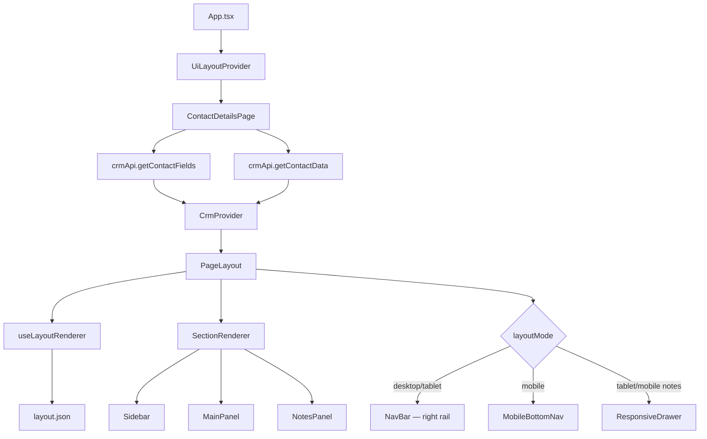

# Pulse CRM

A **config-driven CRM starter** built with React, TypeScript, and Vite. Contact folders, field types, values, and the entire page layout are rendered dynamically from JSON configuration files — no hardcoded panel structure in JSX.

---

## Tech Stack

| Layer | Technology |
|-------|------------|
| UI | React 19 (functional components only) |
| Language | TypeScript |
| Build | Vite |
| Styling | Tailwind CSS v4 |
| Animation | Framer Motion (drawers, page transitions) |
| CRM state | React Context (`CrmContext`) |
| Layout state | React Context (`UiLayoutContext`) |
| Data (mock) | JSON configs + mock API service |

---

## Getting Started

```bash
npm install
npm run dev
```

Open the URL shown in the terminal (usually `http://localhost:5173`).

---

## User Guide

This section describes what you see and how to use the app after it loads.

### First load

When the site first opens (desktop viewport):

1. **Contact list** is shown in the left sidebar — no contact is pre-selected.
2. The **center panel** shows *“No contact selected.”* until you pick a contact.
3. The **Notes panel** is open by default on desktop (inline, right column), but notes are empty until a contact is selected.
4. The **right NavBar** (5 icons) is always visible on desktop/tablet.

On **tablet**, Notes starts closed and opens as a slide-over drawer. On **mobile**, the app shows the Conversations tab with a bottom navigation bar — no multi-column layout.

The app starts in `viewMode: 'list'` with `selectedContactId: null`. Conversations, notes, and contact folders only become active after you select a contact.

### Open a contact

1. In the left sidebar, click any row in the **Contacts** list.
2. The sidebar switches to **Contact Details** (summary card, folders, search).
3. The center panel loads that contact’s **Conversations** timeline.
4. The Notes panel shows that contact’s notes.

To go back to the list, click the **← Contact Details** back arrow in the sidebar header. You can also move between contacts with the **prev / next** pager in the same header.

### Add a contact

1. From the contact list, click the blue **+ Add** button (top right of the sidebar).
2. The **Add Contact** modal opens with fields generated from `contactFields.json`.
3. Fill in the form and submit.
4. The new contact is created, automatically selected, and the sidebar switches to detail view.

### Edit contact fields & Additional Info

Contact folders (**Contact**, **Additional Info**, etc.) are config-driven cards in the sidebar.

**Folder-level edit (recommended):**

1. Open a contact’s detail view.
2. In a folder header, click the **pencil icon** to enter edit mode.
3. Edit field values inline. Press **Enter** to save a single field, or **Escape** to cancel that field.
4. Click **Save** in the folder header to commit all pending changes, or **Cancel** to discard them.

**Folder header icons:**

| Folder | Icons |
|--------|-------|
| **Contact** | **+** (add) and **pencil** (edit) |
| **Additional Info** | **pencil** only |
| **Used Car Buyer Preferences** | **pencil** only |

The **+** button on the Contact folder also enters edit mode (same as pencil). Email fields are validated before save.

**Per-field edit:** While a folder is in edit mode, hover a field label to reveal a small pencil and edit that field individually.

Changes are saved to in-memory state via `updateContact()` — no backend call yet.

### Edit tags

Tags live on the **Contact Summary Card** at the top of the sidebar (below the header).

- **Add a tag:** Click **+ Add** under Tags, type the tag name, then press **Enter** or click away to save.
- **Remove a tag:** Click the **×** on any tag pill.

Tag changes save immediately (unlike folder edits, which use Save/Cancel).

### Access notes

Notes are scoped to the **currently selected contact**.

**Open / close the Notes panel:**

- **Desktop:** Click the **4th icon** (document/notes) on the far-right **NavBar** to toggle the inline panel, or click **×** in the Notes panel header to close it. When Notes is closed, Conversations expands.
- **Tablet:** Notes open as a **slide-over drawer** from the right (NavBar icon or bottom nav). Click the backdrop or press **Esc** to close.
- **Mobile:** Notes open as a **bottom sheet** (Notes tab in bottom nav). Swipe-down handle, backdrop click, or **Esc** closes it.

**Add a note:**

1. Select a contact.
2. In the Notes panel, click **+ Add**.
3. Type in the yellow compose area.
4. Click **Save note** (or **Cancel** to discard).

Notes appear as sticky yellow cards below the compose area, newest first.

### Send a chat message or email

Sending is only available when a contact is selected (center **Conversations** panel visible).

1. Use the **composer** at the bottom of the Conversations panel.
2. Click the **type selector** on the left (chat bubble or envelope icon) and choose **chat** or **email**.
3. Type your message in the text field.
4. Click the blue **Send** button, or press **Enter**.

**Requirements:**

- Send is **disabled** until the input has text.
- The **sparkles (AI)** button is visible but disabled until text is entered; it is a placeholder (*“Modify with AI (coming soon)”*).

Outbound messages are appended to the active contact’s conversation thread immediately.

### Open an email popup

In the conversation timeline, **email cards** show a truncated subject line.

1. Find an email in the Conversations list.
2. Click the **expand icon** (four outward arrows) in the top-right of the email card header.
3. A full **Email popup** opens with the complete subject, sender, body, and actions.

You can also **star** an email, use **Reply**, or open the **⋮** menu (Forward, Mark unread, Archive, Delete) from the card. Star state is persisted in context for the session.

---

### Scripts

| Command | Description |
|---------|-------------|
| `npm run dev` | Start development server |
| `npm run build` | Type-check and build for production |
| `npm run preview` | Preview production build |
| `npm run lint` | Run ESLint |

---

## Application Flow (High Level)

When the app loads, data flows from JSON configs → mock API → page bootstrap → dual context providers → config-driven layout engine → UI panels.



### Step-by-step startup

1. **`main.tsx`** mounts `App` and loads global styles.
2. **`App.tsx`** wraps everything in **`UiLayoutProvider`** (layout/UI state: notes open, mobile tab, breakpoint mode).
3. **`ContactDetailsPage`** fetches CRM data via `crmApi`, then wraps the workspace in **`CrmProvider`**.
4. **`CrmProvider`** initializes with **`viewMode: 'list'`** and **no selected contact**.
5. **`PageLayout`** reads **`layout.json`** via **`useLayoutRenderer`**, picks the correct shell for the current breakpoint, and renders sections dynamically through **`SectionRenderer`**.

---

## Layout Architecture

The page layout is **fully config-driven**. No panel widths, order, or responsive behavior are hardcoded in JSX — they come from **`layout.json`**.

### Layout engine pipeline

```
layout.json
    ↓
useLayoutRenderer()     ← reads current breakpoint from UiLayoutContext
    ↓
PageLayout              ← picks DesktopShell or MobileShell
    ↓
SectionRenderer         ← looks up component in sectionRegistry
    ↓
Sidebar / MainPanel / NotesPanel
```

Supporting pieces:

| File | Role |
|------|------|
| `src/configs/layout.json` | Breakpoints, section definitions, drawer config per mode |
| `src/layouts/useLayoutRenderer.ts` | Normalizes config → sorted sections split by `inline` / `drawer` / `page` |
| `src/layouts/PageLayout.tsx` | Generic shell — flex workspace, drawers, mobile stack |
| `src/layouts/SectionRenderer.tsx` | Applies width/flex styles; renders registered component |
| `src/layouts/sectionRegistry.ts` | Maps `"Sidebar"` → `<Sidebar />`, etc. |
| `src/layouts/ResponsiveDrawer.tsx` | Animated slide-over / bottom sheet with focus trap + ESC |
| `src/layouts/MobileBottomNav.tsx` | Fixed bottom tab bar on mobile |
| `src/context/UiLayoutContext.tsx` | `notesOpen`, `layoutMode`, `mobileSection`, sidebar collapse |
| `src/hooks/useBreakpoint.ts` | Standalone breakpoint hook for visual-only components |

### Responsive breakpoints

Defined in `layout.json` → `breakpoints`:

| Mode | Viewport | Shell |
|------|----------|-------|
| **Desktop** | ≥ 1024px | 3-column flex + right NavBar |
| **Tablet** | 768px – 1023px | 2-column flex + right NavBar + Notes drawer |
| **Mobile** | < 768px | Single active page + bottom nav + Notes bottom sheet |

The active mode is tracked in **`UiLayoutContext.layoutMode`** and re-evaluated on window resize.

### Desktop layout (≥ 1024px)

```
┌──────────────────────────────────────────────────────────────┬────┐
│  Sidebar (320px)    MainPanel (flex-1)    Notes (288px)    │ N  │
│  Contact Details    Conversations           Notes panel      │ a  │
│  white card         white card              white card       │ v  │
└──────────────────────────────────────────────────────────────┴────┘
```

- All three sections use **`mode: "inline"`** — rendered side-by-side in a flex row.
- Notes visibility is controlled by **`notesOpen`** (NavBar 4th icon or panel × button).
- When Notes closes, MainPanel expands to fill the space.
- NavBar is a fixed **56px** right rail.

### Tablet layout (768px – 1023px)

```
┌──────────────────────────────────────────────┬────┐
│  Sidebar (300px)    MainPanel (flex-1)       │ N  │
│  Contact Details    Conversations            │ a  │
└──────────────────────────────────────────────┴────┘
         Notes opens as slide-over drawer →
```

- Sidebar + Main are **`mode: "inline"`**.
- Notes uses **`mode: "drawer"`** — slides in from the right (380px wide) with a backdrop overlay.
- Drawer closes on: backdrop click, **Esc**, or Notes panel × button.
- NavBar stays on the right; 4th icon toggles the drawer.

### Mobile layout (< 768px)

```
┌─────────────────────────────┐
│  [Active page section]      │  ← Sidebar OR MainPanel (one at a time)
│                             │
├─────────────────────────────┤
│ Contacts │ Chat │ Notes │ ⚙ │  ← MobileBottomNav (fixed bottom)
└─────────────────────────────┘
         Notes opens as bottom sheet ↑
```

- No horizontal multi-column layout.
- **`mode: "page"`** sections (Sidebar, MainPanel) are full-screen tabs switched via bottom nav.
- **`mode: "drawer"`** Notes opens as an **85vh bottom sheet** with safe-area padding.
- Page transitions use Framer Motion slide+fade (respects `prefers-reduced-motion`).
- Default tab on load: **main** (Conversations).

### Navigation by breakpoint

| Breakpoint | Navigation | Notes access |
|------------|------------|--------------|
| Desktop | Right vertical NavBar (5 icons) | Inline panel, toggled by 4th icon |
| Tablet | Right vertical NavBar (5 icons) | Right slide-over drawer |
| Mobile | Fixed bottom tab bar (4 tabs) | Bottom sheet via Notes tab |

Only the **Notes** action is fully wired on desktop/tablet NavBar. On mobile, Contacts / Chat / Notes tabs switch sections. Settings is a placeholder on all breakpoints.

---

## How `layout.json` Works

The layout config has four top-level keys:

```json
{
  "breakpoints": { "mobile": 768, "tablet": 1024 },
  "desktop":  { ... },
  "tablet":   { ... },
  "mobile":   { ... }
}
```

Each mode block (`desktop`, `tablet`, `mobile`) defines:

| Key | Purpose |
|-----|---------|
| `type` | Container layout: `"flex"`, `"grid"`, or `"stack"` |
| `navPosition` | Where nav renders: `"right"`, `"bottom"`, `"left"`, `"hidden"` |
| `defaultSection` | (mobile only) Which page tab is active on load |
| `sections` | Array of panel definitions (see below) |
| `drawer` | Drawer position, size, and overlay settings |

### Section definition

Each entry in `sections[]`:

```json
{
  "id": "sidebar",
  "component": "Sidebar",
  "width": "320px",
  "minWidth": "280px",
  "flex": 1,
  "visible": true,
  "order": 1,
  "mode": "inline"
}
```

| Field | Type | Description |
|-------|------|-------------|
| `id` | string | Unique section identifier |
| `component` | string | Key in `sectionRegistry.ts` (`Sidebar`, `MainPanel`, `NotesPanel`) |
| `width` | string | Fixed width (e.g. `"320px"`) |
| `minWidth` | string | Minimum width constraint |
| `maxWidth` | string | Maximum width constraint |
| `height` | string | Fixed height (used in drawers) |
| `flex` | number | Flex grow value (e.g. `1` for MainPanel) |
| `visible` | boolean | Whether the section participates in layout |
| `order` | number | Render order (lower = further left / earlier) |
| `mode` | string | How the section renders (see below) |

### Section modes

| Mode | Used on | Behavior |
|------|---------|----------|
| `"inline"` | Desktop, Tablet | Rendered in the main flex/grid row |
| `"drawer"` | Tablet, Mobile | Hidden until opened; rendered inside `ResponsiveDrawer` |
| `"page"` | Mobile | Full-screen tab; only one visible at a time |

### Drawer config

Applied to sections with `mode: "drawer"`:

```json
"drawer": {
  "position": "right",
  "width": "380px",
  "height": "85vh",
  "overlay": true
}
```

| Field | Values | Description |
|-------|--------|-------------|
| `position` | `"right"`, `"left"`, `"bottom"`, `"top"` | Which edge the drawer slides from |
| `width` | CSS length | Drawer width (right/left drawers) |
| `height` | CSS length | Drawer height (bottom/top sheets) |
| `overlay` | boolean | Show backdrop behind drawer |

### Current section config by mode

| Section | Desktop | Tablet | Mobile |
|---------|---------|--------|--------|
| Sidebar | inline, 320px | inline, 300px | page tab |
| MainPanel | inline, flex:1 | inline, flex:1 | page tab (default) |
| NotesPanel | inline, 288px | drawer, right 380px | drawer, bottom 85vh |

### Adding a new panel (no JSX changes)

1. Create the React component (e.g. `TasksPanel.tsx`).
2. Register it in `src/layouts/sectionRegistry.ts`:
   ```ts
   import { TasksPanel } from '@/components/layout';
   export const SECTION_REGISTRY = { ..., TasksPanel };
   ```
3. Add a section entry to each mode block in `layout.json`:
   ```json
   { "id": "tasks", "component": "TasksPanel", "width": "300px", "order": 4, "mode": "inline" }
   ```

The layout engine picks it up automatically.

---

## UI Layout State (`UiLayoutContext`)

Layout/UI state is separate from CRM business state:

```tsx
const {
  layoutMode,        // 'desktop' | 'tablet' | 'mobile'
  notesOpen,         // whether notes panel/drawer is open
  toggleNotes,       // flip notesOpen
  openNotes,
  closeNotes,
  mobileSection,     // active mobile tab id ('sidebar' | 'main' | ...)
  setMobileSection,
  sidebarCollapsed,  // future-ready
  toggleSidebar,
} = useUiLayout();
```

**Key behaviors:**

- `notesOpen` defaults to `true` on desktop (inline panel visible).
- Switching to tablet/mobile auto-closes inline notes (they reopen as drawers).
- `NavBar` and `MobileBottomNav` both consume `useUiLayout()` — no prop drilling from `App.tsx`.
- `NotesPanel` close button calls `closeNotes()` from context when no `onClose` prop is passed.

---

## Animations

Framer Motion powers layout transitions:

| Interaction | Animation |
|-------------|-----------|
| Tablet Notes drawer | Spring slide from right + backdrop fade |
| Mobile Notes sheet | Spring slide from bottom + backdrop fade |
| Mobile page switch | Horizontal slide + fade between tabs |
| All animations | Respects `prefers-reduced-motion` (instant/no motion) |

Drawer accessibility: focus trap, **Esc** to close, `aria-modal`, backdrop click to dismiss.

---

## Panel Components

Each section component owns its own card styling (`rounded-xl border bg-white shadow-sm`). The layout engine only controls **placement, sizing, and visibility** — not panel internals.

| Panel | Component | Responsibility |
|-------|-----------|----------------|
| Left | `Sidebar` | Contact list / contact detail view, folders, fields |
| Center | `MainPanel` | Mixed email + chat timeline, message composer |
| Right | `NotesPanel` | Per-contact sticky notes (add, close) |
| Far right | `NavBar` | 5-icon nav rail (desktop/tablet); 4th icon toggles Notes |
| Bottom | `MobileBottomNav` | 4-tab bar on mobile (Contacts, Chat, Notes, Settings) |

---

## Data Flow

### 1. Bootstrap (on page load)

```
layout.json         ──►  layout config (imported directly + via crmApi.getLayout())
contactFields.json  ──►  crmApi.getContactFields()  ──►  field/folder definitions
contactData.json    ──►  crmApi.getContactData()    ──►  contacts + notes + conversations
```

The mock API layer (`src/services/api.ts`) keeps components decoupled from where data comes from. Today it returns JSON; later it can be swapped for a real REST/GraphQL API without changing UI components.

### 2. Global state

**CRM state (`CrmContext`)** — business logic, contact data, conversations, notes actions.

**UI layout state (`UiLayoutContext`)** — breakpoint mode, notes open/close, mobile active tab, sidebar collapse.

After bootstrap, CRM interactive state lives in **`CrmProvider`**:

| State | Purpose |
|-------|---------|
| `contacts` | All contact records |
| `fieldsConfig` | Contact field/folder definitions (from `contactFields.json`) |
| `selectedContactId` | Currently viewed contact (`null` on first load) |
| `selectedContactNotes` | Notes for selected contact only |
| `selectedContactConversations` | Conversations for selected contact only |
| `viewMode` | `'list'` (contact list) or `'detail'` (contact detail) |
| `activeTab` | `'allFields'` \| `'dnd'` \| `'actions'` |
| `openFolders` | Which field folders are expanded |
| `searchTerm` | Filters folders/fields in sidebar |

**Per-contact scoping:** Notes and conversations are stored in maps keyed by `contactId`. Switching contacts automatically updates the Notes panel and Conversations feed.

### 3. User actions → state updates

| Action | Context method | Effect |
|--------|----------------|--------|
| Select contact | `setSelectedContactId` + `setViewMode('detail')` | Opens detail sidebar, conversations, and notes |
| Back arrow in sidebar | `setViewMode('list')` | Returns to contact list |
| Add note | `addNote(body)` | Prepends note to active contact |
| Send message | `sendConversation(body, type)` | Appends email or chat to active contact |
| Star email | `toggleConversationStar(id)` | Toggles starred state on email card |
| Add contact | `addContact(data)` | Creates contact + empty notes/conversations |
| Prev/Next pager | `goToPrev` / `goToNext` | Cycles through contacts |

---

## Config-Driven Contact System

Nothing in the contact sidebar is hardcoded. Two JSON files define structure and values.

### `contactFields.json` — UI structure

Defines **folders** and **fields** (what to render and how):

```json
{
  "folders": [
    {
      "id": "contact",
      "name": "Contact",
      "collapsible": true,
      "addable": true,
      "defaultOpen": true,
      "fields": [
        { "key": "firstName", "label": "First Name", "type": "text" },
        { "key": "phone", "label": "Phone Number", "type": "phone" }
      ]
    }
  ]
}
```

- **`key`** must match a property on the contact record in `contactData.json`.
- **`type`** selects which field component renders (see Field Renderer below).

### `contactData.json` — Contact values

Each contact is a flat record with nested arrays for notes and conversations:

```json
{
  "contacts": [
    {
      "id": 1,
      "firstName": "Olivia",
      "lastName": "John",
      "email": "olivia@example.com",
      "owner": { "id": 1, "name": "Devon Lane" },
      "tags": ["VIP"],
      "notes": [ { "id": "n1", "body": "...", "createdAt": "..." } ],
      "conversations": [ { "id": "c1", "type": "email", "subject": "...", "body": "..." } ]
    }
  ]
}
```

---

## Field Renderer System

Fields are rendered dynamically using a **type → component map** in `src/utils/fieldMapper.ts`:

```
contactFields.json
       │
       ▼
  ContactFolder  ──►  ContactField  ──►  FieldRenderer
                                                │
                                    getFieldComponent(field.type)
                                                │
                    ┌───────────────────────────┼───────────────────────────┐
                    ▼                           ▼                           ▼
               TextField                   PhoneField                   EmailField
               AddressField                MultiSelectField             RadioField
               TagsField                   AvatarSelectField
```

Supported field types:

| Type | Component | Display |
|------|-----------|---------|
| `text` | `TextField` | Label + value |
| `email` | `EmailField` | Mailto link |
| `phone` | `PhoneField` | Flag + number + call button |
| `address` | `AddressField` | Multi-line address |
| `multiSelect` | `MultiSelectField` | Chip list |
| `radio` | `RadioField` | Selected option badge |
| `tags` | `TagsField` | Tag pills |
| `avatarSelect` | `AvatarSelectField` | Avatar + name chip |

To add a new field type: create a component in `src/components/contact/fields/`, register it in `fieldComponentMap`, and add the type to `FieldType` in `crm.types.ts`.

---

## Sidebar Flow (Contact Details)

```
ContactDetailsHeader  (back arrow, title, pager)
        │
        ▼
ContactSummaryCard  (avatar, name, call, owner, followers, tags)
        │
        ▼
ToggleButtonGroup   (All Fields | DND | Actions)
        │
        ▼
SearchBar           (filters folders + fields)
        │
        ▼
ContactFolder[]     (collapsible cards from contactFields.json)
        │
        └──► FieldRenderer → typed field component
```

**Contact list mode (default on load):** The app opens with `viewMode = 'list'` and no contact selected. Click a contact to switch to `viewMode = 'detail'`. The back arrow returns to the list.

**Add contact:** `ContactList` opens `AddContactModal`, which dynamically generates form fields from `contactFields.json`. On save, the new contact is selected and detail view opens.

**Edit folders:** Each folder header has icon-only actions — **+** (Contact folder only) and **pencil** (all folders). Folder edit mode shows **Save** / **Cancel** and inline editable fields. Tags are edited separately on the summary card.

---

## Conversations Flow (Center Panel)

The center panel shows a **mixed timeline** of emails and chats for the selected contact.

```
MainPanel
├── ConversationList
│   ├── EmailCard      (subject, thread badge, star, reply, 3-dot menu, expand popup)
│   └── ChatBubble     (inbound left / outbound right)
└── ConversationComposer
    ├── Type dropdown  (email | chat)
    ├── Text input
    ├── AI button      (disabled until text entered; placeholder only)
    └── Send button    (disabled until text entered)
```

**Email cards** support:
- Truncated subject line with expand-to-popup
- Thread count badge (centered circle when `threadCount > 1`)
- Star toggle (persisted in context)
- Reply button and 3-dot menu (Forward, Mark unread, Archive, Delete)

**Sending a message:** Type in the composer, choose **chat** or **email** from the type dropdown, then click **Send** or press **Enter**. Both Send and the AI button stay disabled until text is entered. `ConversationComposer` calls `sendConversation(body, type)`, which appends an outbound email or chat to the active contact's conversation list.

**Email popup:** Click the expand icon on an email card header to open the full `EmailPopup` modal.

---

## Notes Flow (Right Panel)

```
NotesPanel
├── Header   (title, + Add, × close)
├── Compose  (textarea — shown when Add clicked)
└── NotesList → NoteCard[]  (sticky yellow cards, relative timestamps)
```

- Notes are **scoped per contact** — switching contacts changes the list.
- `+ Add` opens an inline compose area; Save calls `addNote(body)`.
- `×` closes the panel/drawer via `useUiLayout().closeNotes()`.
- NavBar (desktop/tablet) or MobileBottomNav (mobile) toggles notes open/closed.
- On tablet: notes slide in from the right. On mobile: notes slide up as a bottom sheet.

---

## Project Structure

```
src/
├── App.tsx                    # Root shell — UiLayoutProvider wrapper
├── main.tsx                   # React entry point
│
├── pages/
│   └── ContactDetailsPage.tsx # Bootstrap data, CrmProvider, PageLayout
│
├── context/
│   ├── CrmContext.tsx         # CRM business state and actions
│   └── UiLayoutContext.tsx    # Layout/UI state (notes, breakpoints, mobile tabs)
│
├── layouts/                   # Config-driven layout engine
│   ├── PageLayout.tsx         # Generic responsive shell (desktop/tablet/mobile)
│   ├── SectionRenderer.tsx    # Dynamic section → component renderer
│   ├── sectionRegistry.ts     # Component name → React component map
│   ├── ResponsiveDrawer.tsx   # Animated slide-over / bottom sheet
│   ├── MobileBottomNav.tsx    # Fixed bottom tab bar (mobile)
│   └── useLayoutRenderer.ts   # Normalizes layout.json for current breakpoint
│
├── services/
│   └── api.ts                 # Mock API (includes getLayout())
│
├── configs/
│   ├── contactFields.json     # Folder + field definitions
│   ├── contactData.json       # Contacts, notes, conversations
│   ├── layout.json            # Responsive layout config (desktop/tablet/mobile)
│   └── notes.json             # Legacy seed notes (API helper)
│
├── components/
│   ├── contact/               # Sidebar: folders, fields, list, modals
│   │   └── fields/            # Typed field renderers
│   ├── conversations/         # EmailCard, ChatBubble, Composer
│   ├── layout/                # Sidebar, MainPanel, NotesPanel, NavBar
│   └── notes/                 # NoteCard, NotesList
│
├── hooks/
│   └── useBreakpoint.ts       # Standalone viewport breakpoint hook
│
├── types/
│   └── crm.types.ts           # CRM + layout TypeScript interfaces
│
├── utils/
│   ├── fieldMapper.ts         # Field type → component map
│   └── formatters.ts          # Dates, avatars, display helpers
│
└── styles/
    └── globals.css            # Tailwind + global styles
```

Path aliases: `@/` maps to `src/` (configured in `vite.config.ts` and `tsconfig.app.json`).

---

## Key Design Principles

1. **Config over code** — Folders, fields, values, and page layout come from JSON, not hardcoded JSX.
2. **Separation of layout vs business state** — `UiLayoutContext` owns breakpoints/notes/nav; `CrmContext` owns CRM data.
3. **Composition over prop drilling** — Panels consume `useCrm()` and `useUiLayout()` directly.
4. **Responsive by configuration** — Desktop/tablet/mobile behavior is defined in `layout.json`, not scattered Tailwind classes.
5. **Extensible section registry** — New panels = one registry entry + one config block.
6. **Per-contact data** — Notes and conversations are keyed by contact ID and react to selection changes.
7. **Extensible field system** — New field types = new component + one map entry + one type union member.

---

## Planned Enhancements

- [ ] Replace mock API with real backend integration
- [ ] Layout switching from user preferences (load alternate `layout.json` profiles)
- [ ] Sidebar collapse on tablet (wire `sidebarCollapsed` from `UiLayoutContext`)
- [ ] Permission-based layout visibility rules in `useLayoutRenderer`
- [ ] Caching for frequently opened contacts
- [ ] Permission-based field visibility rules
- [ ] AI text modification in conversation composer
- [ ] DND and Actions tab content
- [ ] Named icon library (Heroicons/Lucide) to replace inline SVGs

---

## License

Private project — see repository owner for usage terms.
